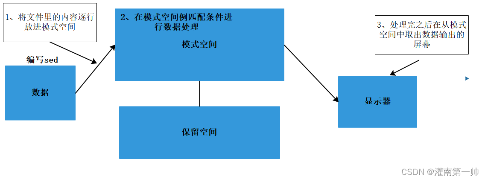

# Sed

在 Linux/UNIX 系统中包含很多种类的文本处理器或文本编辑器，其中包括其中包括我们之前学习过的 Vim 编辑器与 grep 等。而 grep，sed，awk 更是 Shell 编程中经常用到的文本处理工具， 被称之为 Shell 编程三剑客。

**sed（Stream EDitor）**是一个强大而简单的文本解析转换工具，可以读取文本，并根据指定的条件对文本内容进行编辑（删除、替换、添加、移动等），最后输出所有行或者仅输出处理的某些行。sed 也可以在无交互的情况下实现相当复杂的文本处理操作，被广泛应用于 Shell 脚本中，用以完成各种自动化处理任务。

sed 的工作流程主要包括读取、执行和显示三个过程。

- **读取**：sed 从输入流（文件、管道、标准输入）中读取一行内容并存储到**临时的缓冲区中（又称模式空间，pattern space）。**
- **执行**：默认情况下，所有的 sed 命令都在模式空间中顺序地执行，除非指定了行的地址，否则 sed 命令将会在所有的行上依次执行。
- **显示**：发送修改后的内容到输出流。在发送数据后，模式空间将会被清空。

在所有的文件内容都被处理完成之前，上述过程将重复执行，直至所有内容被处理完。

> **注意：默认情况下所有的 sed 命令都是在模式空间内执行的，因此输入的文件并不会发生任何变化，除非是用重定向存储输出。**

```
**sed**是一种流编辑器，它是文本处理中非常好的工具，能够完美的配合正则表达式使用，功能不同凡响。

处理时，把当前处理的行存储在临时缓冲区中，称为“模式空间”（pattern space），接着用sed[命令](https://www.linuxcool.com/)处理缓冲区中的内容，处理完成后，把缓冲区的内容送往屏幕。接着处理下一行，这样不断重复，直到文件末尾。文件内容并没有改变，除非你使用重定向存储输出。

Sed主要用来自动编辑一个或多个文件，可以将数据行进行替换、删除、新增、选取等特定工作，简化对文件的反复操作，编写转换程序等。
```




## sed 的选项、[命令](https://www.linuxcool.com/)、替换标记

### 命令格式

```bash
sed的命令格式：sed [选项] '命令' files;
sed的脚本格式：sed [选项] -f scriptfile files;
```

| 选项 | 含义                                                                    |
| ---- | ----------------------------------------------------------------------- |
| `-e` | 直接在命令行模式上进行 sed 动作编辑，此为默认选项;                      |
| `-i` | 直接修改文件内容;                                                       |
| `-n` | 只打印模式匹配的行；                                                    |
| `-f` | 将 sed 的动作写在一个文件内，用–f filename 执行 filename 内的 sed 动作; |
| `-h` | 或`--help`，显示帮助；                                                  |
| `-V` | 或`--version`，显示版本信息。                                           |
| `-r` | 支持扩展表达式;                                                         |

| 命令 | 含义                                                        |
| ---- | ----------------------------------------------------------- |
| `a`  | 在当前行下面插入文本;                                       |
| `c`  | 把选定的行改为新的文本;                                     |
| `d`  | 删除选择的行。 D(大写) 删除模板块的第一行;                  |
| `i`  | 在当前行上面插入文本;                                       |
| `p`  | 打印模板块的行。 P(大写) 打印模板块的第一行;                |
| `s`  | 替换指定字符;                                               |
| `y`  | 字符转换                                                    |
| `n`  | 读取下一个输入行，用下一个命令处理新的行而不是用第一个命令; |
|      |                                                             |

```
 h 拷贝模板块的内容到内存中的缓冲区;
 H 追加模板块的内容到内存中的缓冲区;
 g 获得内存缓冲区的内容，并替代当前模板块中的文本;
 G 获得内存缓冲区的内容，并追加到当前模板块文本的后面;
 l 列表不能打印字符的清单;
 N 追加下一个输入行到模板块后面并在二者间嵌入一个新行，改变当前行号码;
 q 退出Sed;
 b lable 分支到脚本中带有标记的地方，如果分支不存在则分支到脚本的末尾;
 r file 从file中读行;
 t label if分支，从最后一行开始，条件一旦满足或者T，t命令，将导致分支到带有标号的命令处，或者到脚本的末尾;
 T label 错误分支，从最后一行开始，一旦发生错误或者T，t命令，将导致分支到带有标号的命令处，或者到脚本的末尾;
 w file 写并追加模板块到file末尾;
 W file 写并追加模板块的第一行到file末尾;
 ! 表示后面的命令对所有没有被选定的行发生作用;
 = 打印当前行号;
 # 把注释扩展到下一个换行符以前;
```

### sed 替换标记

```
 g 表示行内全面替换;
 p 表示打印行;
 w 表示把行写入一个文件;
 x 表示互换模板块中的文本和缓冲区中的文本;
 y 表示把一个字符翻译为另外的字符（但是不用于正则表达式）;
 \1 子串匹配标记;
 & 已匹配字符串标记;
```

### sed 元字符集

```
 ^ 匹配行开始，如：/^sed/匹配所有以sed开头的行;
 $ 匹配行结束，如：/sed$/匹配所有以sed结尾的行;
 . 匹配一个非换行符的任意字符，如：/s.d/匹配s后接一个任意字符，最后是d;
 * 匹配0个或多个字符，如：/*sed/匹配所有模板是一个或多个空格后紧跟sed的行;
 [] 匹配一个指定范围内的字符，如/[ss]ed/匹配sed和Sed;
 [^] 匹配一个不在指定范围内的字符，如：/[^A-RT-Z]ed/匹配不包含A-R和T-Z的一个字母开头，紧跟ed的行;
 \(..\) 匹配子串，保存匹配的字符，如s/\(love\)able/\1rs，loveable被替换成lovers;
 & 保存搜索字符用来替换其他字符，如s/love/**&**/，love这成**love**;
 \< 匹配单词的开始，如:/\
 \> 匹配单词的结束，如/love\>/匹配包含以love结尾的单词的行;
 x\{m\} 重复字符x，m次，如：/0\{5\}/匹配包含5个0的行;
 x\{m,\} 重复字符x，至少m次，如：/0\{5,\}/匹配至少有5个0的行;
 x\{m,n\} 重复字符x，至少m次，不多于n次，如：/0\{5,10\}/匹配5~10个0的行;
```

## Sed 实战

### 输出案例

```bash
# sed [选项] '命令' files
sed -n 'p' test.txt   	# 输出所有内容, 等同于Linux下的 cat test.txt
sed -n '3p' test.txt  	# 只显示test.txt文本中第三行的内容
sed -n '2，4p' test.txt  # 只显示test.txt文本中第二行到第四行的内容
sed -n 'p;n' test.txt   # 第二个n表示读入下一行内容，最终效果是显示所有奇数行
sed -n 'n;p' test.txt   # 最终效果是显示所有偶数行
sed -n '/the/p' test.txt  # 输出包含the的行
sed -n '/[0-9]$/p' test.txt		# 输出以数字结尾的行
```

### 删除案例

```bash
nl test.txt | sed '5d'		# 读取test.txt文本内容，删除第5行，并输出到屏幕（test.txt的内容没有改变）
nl test.txt | sed '5,10d'	# 读取test.txt文本内容，删除第5到10行，并输出到屏幕（test.txt的内容没有改变）
nl test.txt | sed '/the/d'	# 读取test.txt文本内容，删除包含the的行，并输出到屏幕（test.txt的内容没有改变）
nl test.txt | sed '/^[A-Z]/d'	# 读取test.txt文本内容，删除以大写字母开头的行，并输出到屏幕（test.txt的内容没有改变）

```

### 替换案例

```bash
sed 's/the/THE/' test.txt		# 将第一个小写的the替换为大写的THE
sed 's/a/b/2' test.txt			# 将行中第2个a替换为b
sed 's/the/THE/g' test.txt		# 将所有小写的the替换为大写的THE
sed 's/^/#/' test.txt			# 每行行首添加#号
sed '/girl/s/^/#/' test.txt		# 在包含girl的行首添加#号
sed '/13,14s/o/B/g' test.txt	# 13,到14行所有字符o替换成字符B
sed '/the/s/o/B/g' test.txt		# 所有包含the的行中的字符o替换成字符B
```

**sed 用户实例**

**替换操作：s 命令**

替换文本中的字符串：

```
 sed 's/book/books/' file
```

**-n 选项**和**p 命令**一起使用表示只打印那些发生替换的行：

```
 sed -n 's/test/TEST/p' file
```

直接编辑文件**选项-i**，会匹配 file 文件中每一行的第一个 book 替换为 books

```
 sed -i 's/book/books/g' file
```

**全面替换标记 g**

使用后缀 /g 标记会替换每一行中的所有匹配：

```
 sed 's/book/books/g' file
```

当需要从第 N 处匹配开始替换时，可以使用 /Ng：

```
 echo sksksksksksk | sed 's/sk/SK/2g'
 skSKSKSKSKSK
 echo sksksksksksk | sed 's/sk/SK/3g'
 skskSKSKSKSK
 echo sksksksksksk | sed 's/sk/SK/4g'
 skskskSKSKSK
```

**定界符**

以上命令中字符 / 在 sed 中作为定界符使用，也可以使用任意的定界符

```
 sed 's:test:TEXT:g'
 sed 's|test|TEXT|g'
```

定界符出现在样式内部时，需要进行转义：

```
 sed 's/\/bin/\/usr\/local\/bin/g'
```

**删除操作：d 命令**

删除空白行：

```
 sed '/^$/d' file
```

删除文件的第 2 行：

```
 sed '2d' file
```

删除文件的第 2 行到末尾所有行：

```
 sed '2,$d' file
```

删除文件最后一行：

```
 sed '$d' file
```

删除文件中所有开头是 test 的行：

```
 sed '/^test/'d file
```

**已匹配字符串标记&**

正则表达式 \w\+ 匹配每一个单词，使用 [&] 替换它，& 对应于之前所匹配到的单词：

```
 echo this is a test line | sed 's/\w\+/[&]/g'
 [this] [is] [a] [test] [line]
```

所有以 192.168.0.1 开头的行都会被替换成它自已加 localhost：

```
 sed 's/^192.168.0.1/&localhost/' file 192.168.0.1localhost
```

**子串匹配标记\1**

匹配给定样式的其中一部分：

```
 echo this is digit 7 in a number | sed 's/digit \([0-9]\)/\1/'
 this is 7 in a number
```

命令中 digit 7，被替换成了 7。样式匹配到的子串是 7，\(..\) 用于匹配子串，对于匹配到的第一个子串就标记为 \1，依此类推匹配到的第二个结果就是 \2，例如：

```
 echo aaa BBB | sed 's/\([a-z]\+\) \([A-Z]\+\)/\2 \1/'
 BBB aaa
```

love 被标记为 1，所有 loveable 会被替换成 lovers，并打印出来：

```
 sed -n 's/\(love\)able/\1rs/p' file
```

**组合多个表达式**

```
 sed '表达式' | sed '表达式'  等价于：
 sed '表达式; 表达式'
```

**引用**

sed 表达式可以使用单引号来引用，但是如果表达式内部包含变量字符串，就需要使用双引号。

```
 test=hello
 echo hello WORLD | sed "s/$test/HELLO"
 HELLO WORLD
```

**选定行的范围：,（逗号）**

所有在模板 test 和 check 所确定的范围内的行都被打印：

```
 sed -n '/test/,/check/p' file
```

打印从第 5 行开始到第一个包含以 test 开始的行之间的所有行：

```
 sed -n '5,/^test/p' file
```

对于模板 test 和 west 之间的行，每行的末尾用字符串 aaa bbb 替换：

```
 sed '/test/,/west/s/$/aaa bbb/' file
```

**多点编辑：e 命令**

-e 选项允许在同一行里执行多条命令：

```
 sed -e '1,5d' -e 's/test/check/' file
```

上面 sed 表达式的第一条命令删除 1 至 5 行，第二条命令用 check 替换 test。命令的执行顺序对结果有影响。如果两个命令都是替换命令，那么第一个替换命令将影响第二个替换命令的结果。

和 -e 等价的命令是 --expression：

```
 sed --expression='s/test/check/' --expression='/love/d' file
```

**从文件读入：r 命令**

file 里的内容被读进来，显示在与 test 匹配的行后面，如果匹配多行，则 file 的内容将显示在所有匹配行的下面：

```
 sed '/test/r file' filename
```

**写入文件：w 命令**

在 example 中所有包含 test 的行都被写入 file 里：

```
 sed -n '/test/w file' example
```

**追加（行下）：a\命令**

将 this is a test line 追加到 以 test 开头的行后面：

```
 sed '/^test/a\this is a test line' file
```

在 test.conf 文件第 2 行之后插入 this is a test line：

```
 sed -i '2a\this is a test line' test.conf
```

**插入（行上）：**

i\命令 将 this is a test line 追加到以 test 开头的行前面：

```
 sed '/^test/i\this is a test line' file
```

在 test.conf 文件第 5 行之前插入 this is a test line：

```
 sed -i '5i\this is a test line' test.conf
```

**下一个：n 命令**

如果 test 被匹配，则移动到匹配行的下一行，替换这一行的 aa，变为 bb，并打印该行，然后继续：

```
 sed '/test/{ n; s/aa/bb/; }' file
```

**变形：y 命令**

把 1~10 行内所有 abcde 转变为大写，注意，正则表达式元字符不能使用这个命令：

```
 sed '1,10y/abcde/ABCDE/' file
```

**退出：q 命令**

打印完第 10 行后，退出 sed sed '10q' file 保持和获取：h 命令和 G 命令 在 sed 处理文件的时候，每一行都被保存在一个叫模式空间的临时缓冲区中，除非行被删除或者输出被取消，否则所有被处理的行都将打印在屏幕上。接着模式空间被清空，并存入新的一行等待处理。

```
 sed -e '/test/h' -e '$G' file
```

在这个例子里，匹配 test 的行被找到后，将存入模式空间，h 命令将其复制并存入一个称为保持缓存区的特殊缓冲区内。第二条语句的意思是，当到达最后一行后，G 命令取出保持缓冲区的行，然后把它放回模式空间中，且追加到现在已经存在于模式空间中的行的末尾。在这个例子中就是追加到最后一行。简单来说，任何包含 test 的行都被复制并追加到该文件的末尾。

**保持和互换：h 命令和 x 命令**

互换模式空间和保持缓冲区的内容。也就是把包含 test 与 check 的行互换：

```
 sed -e '/test/h' -e '/check/x' file
```

**脚本 scriptfile**

sed 脚本是一个 sed 的命令清单，启动 Sed 时以-f 选项引导脚本文件名。Sed 对于脚本中输入的命令非常挑剔，在命令的末尾不能有任何空白或文本，如果在一行中有多个命令，要用分号分隔。以#开头的行为注释行，且不能跨行。

```
 sed [options] -f scriptfile file(s)
```

**打印奇数行或偶数行**

方法 1：

```
 sed -n 'p;n' test.txt  #奇数行 sed -n 'n;p' test.txt  #偶数行
```

方法 2：

```
 sed -n '1~2p' test.txt  #奇数行 sed -n '2~2p' test.txt  #偶数行
```

**打印匹配字符串的下一行**

```
 grep -A 1 SCC URFILE
 sed -n '/SCC/{n;p}' URFILE
 awk '/SCC/{getline; print}' URFILE
```

## Reference

https://blog.csdn.net/m0_58292366/article/details/124586128
