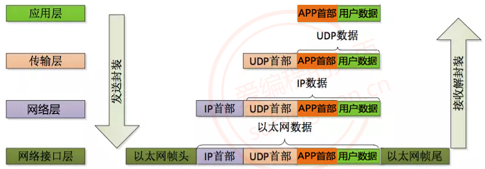
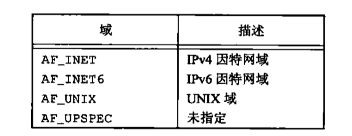
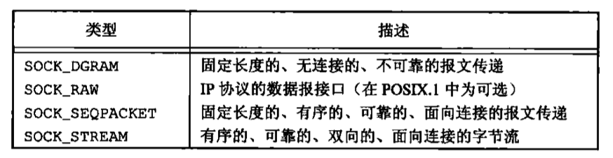

# Socket

## 网络协议

网络协议指的是计算机网络中互相通信的对等实体之间交换信息时所必须遵守的规则的集合。一般系统网络协议包括五个部分：通信环境，传输服务，词汇表，信息的编码格式，时序、规则和过程。先来通过下面几幅图了解一下常用的网络协议的格式：

> TCP 协议 -> 传输层协议


> UDP 协议 -> 传输层协议


> IP 协议 -> 网络层协议


> 以太网帧协议 -> 网络接口层协议


> 数据的封装




## Socket概述

Socket 套接字由远景研究规划局（Advanced Research Projects Agency, ARPA）资助加里福尼亚大学伯克利分校的一个研究组研发。其目的是将 TCP/IP 协议相关软件移植到 UNIX 类系统中。设计者开发了一个接口，以便应用程序能简单地调用该接口通信。这个接口不断完善，最终形成了 Socket 套接字。Linux 系统采用了 Socket 套接字，因此，Socket 接口就被广泛使用，到现在已经成为事实上的标准。与套接字相关的函数被包含在头文件 `sys/socket.h` 中。


通过上面的描述可以得知，套接字对应程序猿来说就是一套网络通信的接口，使用这套接口就可以完成网络通信。网络通信的主体主要分为两部分：客户端和服务器端。在客户端和服务器通信的时候需要频繁提到三个概念：**IP、端口、通信数据**


### Socket定义

socket起源于Unix，而Unix/Linux基本哲学之一就是“一切皆文件”，都可以用“打开open –> 读写write/read –> 关闭close”模式来操作。我的理解就是Socket就是该模式的一个实现，socket即是一种特殊的文件，一些socket函数就是对其进行的操作（读/写IO、打开、关闭）。

在TCP/IP协议中，"IP地址+TCP或UDP端口号"唯一标识网络通讯中的一个进程。"IP地址+端口号"就对应一个socket。


### 套接字类型

- 流套接字（SOCK_STREAM）

- 数据报套接字（SOCK_DGRAM）

- 原始套机子（SOCK_RAW）


### 协议簇和地址簇

协议簇就是不同协议的集合，在linux中，用宏来表示不同的协议簇，这个宏的形式是PF开头，比如IPv4协议为`PF_INET`，PF的意思就是PROTOCOL FAMILY

地址簇就是一个协议所使用的地址集合，也是用宏来表示不同的地址簇，这个宏的形式是AF开头，比如IP地址簇为AF_INET，AF的意思是ADDRESS FAMILY


### IP地址转换

https://www.cnblogs.com/fortunely/p/14916296.html

推荐使用`inet_pton()`或`inet_ntop()`。而非`inet_addr()`或`inet_network()`，因为返回值-1代表IP地址255.255.255.255。

**inet_pton(), inet_ntop()适用于IPv4和IPv6**

```c
/*本地IP 即 字符串(点分十进制:xxx.xxx.xx.xxx)*/
/**
 * 本地IP转网络字节序 字符串 --> int(大端方式存储)
 * @param af 地址族协议对应的有AF_INET, AF_INET6等
 * @param src 要转换的指定的IP
 * @param dst  转换出来的值,  其实是整型值
 *
 * @return -1 失败, 0成功, 并对应有errno
 */
int inet_pton(int af, const char *src, void *dst);


/**
 *  网络字节序转本地IP int -> 字符串
 *  @param af    - 地址族协议对应的有AF_INET, AF_INET6等
 *  @param src  - 网路字节序格式的int类型的iP
 *  @param dst  - 存储字符串ip的数组的地址
 *  @param size - dst缓冲区大小
 *
 *  @return 返回的即是 dst
 */
const char *inet_ntop(int af, const void *src, char *dst, socklen_t size);
```


还有一组函数也能进程 IP 地址大小端的转换，但是只能处理 ipv4 的 ip 地址：

```cpp
// 点分十进制IP -> 大端整形
in_addr_t inet_addr (const char *cp);

// 大端整形 -> 点分十进制IP
char* inet_ntoa(struct in_addr in);
```


### 字节序

> ### 网络字节序与主机字节序
>
> **主机字节序**就是我们平常说的大端和小端模式：不同的CPU有不同的字节序类型，这些字节序是指整数在内存中保存的顺序，这个叫做主机序。引用标准的Big-Endian和Little-Endian的定义如下：
>
> * Little-Endian就是低位字节排放在内存的低地址端，高位字节排放在内存的高地址端。
>
> * Big-Endian就是高位字节排放在内存的低地址端，低位字节排放在内存的高地址端。
>
> **网络字节序**：4个字节的32 bit值以下面的次序传输：首先是0～7bit，其次8～15bit，然后16～23bit，最后是24~31bit。这种传输次序称作大端字节序。**由于TCP/IP首部中所有的二进制整数在网络中传输时都要求以这种次序，因此它又称作网络字节序。**字节序，顾名思义字节的顺序，就是大于一个字节类型的数据在内存中的存放顺序，一个字节的数据没有顺序的问题了。
>
> **在将一个地址绑定到socket的时候，请先将主机字节序转换成为网络字节序，而不要假定主机字节序跟网络字节序一样使用的是Big-Endian。**由于这个问题曾引发过血案！公司项目代码中由于存在这个问题，导致了很多莫名其妙的问题，所以请谨记对主机字节序不要做任何假定，务必将其转化为网络字节序再赋给socket。

> BSD Socket 提供了封装好的转换接口，方便程序员使用。包括从主机字节序到网络字节序的转换函数：htons、htonl；从网络字节序到主机字节序的转换函数：ntohs、ntohl。

```c
#include <arpa/inet.h>
// u:unsigned
// 16: 16位, 32:32位
// h: host, 主机字节序
// n: net, 网络字节序
// s: short
// l: int

// 这套api主要用于 网络通信过程中 IP 和 端口 的 转换
// 将一个短整形从主机字节序 -> 网络字节序
uint16_t htons(uint16_t hostshort);	/* 端口 */
// 将一个整形从主机字节序 -> 网络字节序
uint32_t htonl(uint32_t hostlong);	/* IP */

// 将一个短整形从网络字节序 -> 主机字节序
uint16_t ntohs(uint16_t netshort)	/* 端口 */
// 将一个整形从网络字节序 -> 主机字节序
uint32_t ntohl(uint32_t netlong);	/* IP */
```


## sockaddr数据结构

根据使用场景不同，创建`sockaddr_in`, `sockaddr_un`, `sockaddr_in6`结构体来保存IP地址信息，但在使用的时候，统一将结构体的地址保存在`sockaddr`的地址域内，这样屏蔽了底层实现细节。向上层交付的就是一个结构体。


```cpp
// ipv4对应的是：
struct sockaddr_in {
    sa_family_t    sin_family; /* address family: AF_INET */
    in_port_t      sin_port;   /* port in network byte order */
    struct in_addr sin_addr;   /* internet address */
};
struct in_addr {
    uint32_t       s_addr;     /* address in network byte order */
};

// ipv6对应的是：
struct sockaddr_in6 { 
    sa_family_t     sin6_family;   /* AF_INET6 */ 
    in_port_t       sin6_port;     /* port number */ 
    uint32_t        sin6_flowinfo; /* IPv6 flow information */ 
    struct in6_addr sin6_addr;     /* IPv6 address */ 
    uint32_t        sin6_scope_id; /* Scope ID (new in 2.4) */ 
};
struct in6_addr { 
    unsigned char   s6_addr[16];   /* IPv6 address */ 
};

// Unix域
#define UNIX_PATH_MAX    108
struct sockaddr_un { 
    sa_family_t sun_family;               /* AF_UNIX */ 
    char        sun_path[UNIX_PATH_MAX];  /* pathname */ 
};
```


## 网络套接字API

```C
/**
 * @brief  创建套接字
 *
 * @param domain
 * @param type tcp - 流式协议  udp - 报式协议
 * @param protocol 协议类型, 值为0就会根据type默认为TCP或UDP
 * @return int 文件描述符(套接字)
 */
int socket(int domain, int type, int protocol);

/**
 * @brief 将本地的IP和端口与创建出的套接字绑定
 *
 * @param sockfd 创建出的文件描述符
 * @param addr 端口和IP
 * @param addrlen addr结构体的长度
 * @return int
 */
int bind(int sockfd, const struct sockaddr *addr, socklen_t addrlen);

//
/**
 * @brief 设置同时连接到服务器的客户端的个数
 *
 * @param sockfd 函数创建出来的文件描述符
 * @param backlog 系统进程最多允许多少个未完成的请求进入等待队列，最大值 128
 * @return int
 */
int listen(int sockfd, int backlog);

/**
 * @brief 阻塞等待客户端连接请求, 并接受连接
 *
 * @param sockfd 文件描述符, 使用socket创建出的文件描述符
 * @param addr 存储客户端的端口和IP, 传出参数
 * @param addrlen 传入传出参数
 * @return int 返回的是一个套接字, 对应客户端:
 * 服务器端与客户端进程通信使用accept的返回值对应的套接字
 */
int accept(int sockfd, struct sockaddr *addr, socklen_t *addrlen);

//客户端与服务器端建立连接的函数
/**
 * @brief
 *
 * @param sockfd 套接字
 * @param addr 服务器端的IP和端口
 * @param addrlen 第二个参数的长度
 * @return int
 */
int connect(int sockfd, const struct sockaddr *addr, socklen_t addrlen);

/**
 * @brief 发送数据
 *
 * @param sockfd accept返回的socket文件描述符。
 * @param buf 要发送数据
 * @param nbytes 发送数据大小
 * @param flags 对于传送数据的一些配置项
 * @return ssize_t
 */
ssize_t send(int sockfd, const void *buf, size_t nbytes, int flags);

/**
 * @brief 接收数据
 *
 * @param sockfd accept返回的socket文件描述符。
 * @param buf 要接收的数据
 * @param nbytes 要接收的数据大小
 * @param flags 对于传送数据的一些配置项
 * @return ssize_t
 */
ssize_t recv(int sockfd, void *buf, size_t nbytes, int flags);
```


### socket()

```c
//函数的返回值是一个文件描述符，通过这个文件描述符可以操作内核中的某一块内存，网络通信是基于这个文件描述符来完成的。失败返回-1
int socket(int domain, int type, int protocol);
```

socket函数对应于普通文件的打开操作。普通文件的打开操作返回一个文件描述字，而**socket()**用于创建一个socket描述符（socket descriptor），**它唯一标识一个socket**。这个socket描述字跟文件描述字一样，后续的操作都有用到它，把它作为参数，通过它来进行一些读写操作。

正如可以给`fopen()`的传入不同参数值，以打开不同的文件。创建socket的时候，也可以指定不同的参数创建不同的socket描述符，socket函数的三个参数分别为：

`domain`: 使用的地址族协议

- AF_INET: 使用 IPv4 格式的 ip 地址
- AF_INET6: 使用 IPv4 格式的 ip 地址

`type`:

- SOCK_STREAM: 使用流式的传输协议
- SOCK_DGRAM: 使用报式 (报文) 的传输协议

`protocol`: 一般写 0 即可，使用默认的协议

- SOCK_STREAM: 流式传输默认使用的是 tcp
- SOCK_DGRAM: 报式传输默认使用的 udp

注意：并不是上面的type和protocol可以随意组合的，如SOCK_STREAM不可以跟IPPROTO_UDP组合。**protocol一般取0时，自动选择type类型对应的默认协议。**

> 当我们调用**socket**创建一个socket时，返回的socket描述字它存在于协议族（address family，AF_XXX）空间中，但没有一个具体的地址。如果想要给它赋值一个地址，就必须调用bind()函数，否则当调用connect()、listen()时系统会自动随机分配一个端口。







### bind()

**bind()函数把一个地址族中的特定地址赋给socket。**例如对应AF_INET、AF_INET6就是把一个ipv4或ipv6地址和端口号组合赋给socket。

```c
// 将文件描述符和本地的IP与端口进行绑定   
int bind(int sockfd, const struct sockaddr *addr, socklen_t addrlen);
```

- `sockfd`: 监听的文件描述符，通过 socket () 调用得到的返回值
- `addr`: 传入参数，要绑定的 IP 和端口信息需要初始化到这个结构体中，**IP和端口要转换为网络字节序**
- `addrlen`: 参数 addr 指向的内存大小，sizeof (struct sockaddr)

* 返回值：成功返回 0，失败返回 - 1

> 为什么通常服务器端在listen之前会调用bind()，而客户端就不会调用，而是在connect()时由系统随机生成一个。
>
> 通常服务器在启动的时候都会绑定一个众所周知的地址（如ip地址+端口号），用于提供服务，客户就可以通过它来接连服务器；而客户端就不用指定，系统会自动分配一个端口号和自身的ip地址组合。


### listen()

socket()函数创建的socket默认是一个主动类型的，listen函数将socket变为被动类型的，等待客户的连接请求。

```cpp
// 给监听的套接字设置监听
int listen(int sockfd, int backlog);
```

- sockfd: 文件描述符，可以通过调用 socket () 得到，在监听之前必须要绑定 bind ()
- backlog: 同时能处理的最大连接要求，最大值为 128
- 返回值：函数调用成功返回 0，调用失败返回 -1


### connect()

```cpp
// 成功连接服务器之后, 客户端会自动随机绑定一个端口
// 服务器端调用accept()的函数, 第二个参数存储的就是客户端的IP和端口信息
int connect(int sockfd, const struct sockaddr *addr, socklen_t addrlen);
```

- `sockfd`: 通信的文件描述符，通过调用 socket () 函数就得到了
- `addr`: 存储了要连接的服务器端的地址信息: IP 和 端口，这个 IP 和端口也需要转换为大端然后再赋值
- `addrlen`: addr 指针指向的内存的大小 sizeof (struct sockaddr)
- 返回值：连接成功返回 0，连接失败返回 - 1


### accept()

TCP服务器端依次调用socket()、bind()、listen()之后，就会监听指定的socket地址了。TCP客户端依次调用socket()、connect()之后就向TCP服务器发送了一个连接请求。TCP服务器监听到这个请求之后，就会调用accept()函数取接收请求，这样连接就建立好了。之后就可以开始网络I/O操作了，即类同于普通文件的读写I/O操作。

```c
// 等待并接受客户端的连接请求, 建立新的连接, 会得到一个新的文件描述符(通信的)		
int accept(int sockfd, struct sockaddr *addr, socklen_t *addrlen);
```

- sockfd: 监听的文件描述符
- addr: 传出参数，里边存储了建立连接的客户端的地址信息
- addrlen: 传入传出参数，用于存储 addr 指向的内存大小
- 返回值：函数调用成功，得到一个文件描述符，用于和建立连接的这个客户端通信，调用失败返回 -1

**这个函数是一个阻塞函数**，当没有新的客户端连接请求的时候，该函数阻塞；当检测到有新的客户端连接请求时，阻塞解除，新连接就建立了，得到的返回值也是一个文件描述符，基于这个文件描述符就可以和客户端通信了。

> 在 TCP 的服务器端，有两类文件描述符：**监听的文件描述符**和**通信的文件描述符**
>
> `accept()`的第一个参数是服务器开始时调用`socket()`函数生成的监听的文件描述符，而`accept()`函数返回的是通信的文件描述符。
>
> - 监听的文件描述符：只需要有一个，不负责和客户端通信，负责检测客户端的连接请求，检测到之后调用 `accept() `就可以建立新的连接
> - 通信的文件描述符：负责和建立连接的客户端通信。如果有 N 个客户端和服务器建立了新的连接，通信的文件描述符就有 N 个，每个客户端和服务器都对应一个通信的文件描述符
>
> 一个服务器通常通常仅仅只创建一个监听socket描述字，它在该服务器的生命周期内一直存在。内核为每个由服务器进程接受的客户连接创建了一个已连接socket描述字，当服务器完成了对某个客户的服务，相应的已连接socket描述字就被关闭。


### read()/recv()

```cpp
// 接收数据
ssize_t read(int sockfd, void *buf, size_t size);
ssize_t recv(int sockfd, void *buf, size_t size, int flags);
```

- sockfd: 用于通信的文件描述符，accept () 函数的返回值
- buf: 指向一块有效内存，用于存储接收是数据
- size: 参数 buf 指向的内存的容量
- flags: 特殊的属性，一般不使用，指定为 0


返回值:

- 大于 0：实际接收的字节数
- 等于 0：对方断开了连接
- -1：接收数据失败了

如果连接没有断开，接收端接收不到数据，接收数据的函数会阻塞等待数据到达，数据到达后函数解除阻塞，开始接收数据。**当发送端断开连接，接收端无法接收到任何数据，但是这时候就不会阻塞了，函数直接返回0。**


### write()/send()

```cpp
// 发送数据的函数
ssize_t write(int fd, const void *buf, size_t len);
ssize_t send(int fd, const void *buf, size_t len, int flags);
```

- fd: 通信的文件描述符，accept () 函数的返回值
- buf: 传入参数，要发送的字符串
- len: 要发送的字符串的长度
- flags: 特殊的属性，一般不使用，指定为 0

返回值：

- 大于 0：实际发送的字节数，和参数 len 是相等的
- -1：发送数据失败了


### close()

在服务器与客户端建立连接之后，会进行一些读写操作，完成了读写操作就要关闭相应的socket描述字，好比操作完打开的文件要调用fclose关闭打开的文件。

```c 
#include <unistd.h>
int close(int fd);
```

close一个TCP socket的缺省行为时把该socket标记为以关闭，然后立即返回到调用进程。该描述字不能再由调用进程使用，也就是说不能再作为read或write的第一个参数。

注意：close操作只是使相应socket描述字的引用计数-1，只有当引用计数为0的时候，才会触发TCP客户端向服务器发送终止连接请求。

### setsockopt()

```c
/**
 * @brief socket更具体的配置函数
 *
 * @param sockfd 用于监听的文件描述符
 * @param level 根据我们选用的协议，配置相应的协议编号。设置端口复用需要使用 SOL_SOCKET 宏
 * @param optname：要设置什么属性。设置端口复用需使用 SO_REUSEADDR
 * @param optval：是否设置端口复用，0：不设置，1：设置
 * @param optlen：optval 指针指向的内存大小 sizeof (int)
 * @return int
 */
// 这个函数是一个多功能函数, 可以设置套接字选项
int setsockopt(int sockfd, int level, int optname, const void *optval, socklen_t optlen);
```


### 端口复用

一个程序成功bind后，当程序退出马上再次运行后，可能会因为端口占用问题报错（错误码98）。这是由于TCP套接字的状态`TIME_WAIT`引起的，该状态在套接字关闭后保留2-4分钟。在`TIME_WAIT`状态退出后，套接字被删除才能继续使用端口。

利用socket的配置选项，可以实现端口复用。**注意：该函数需要在bind函数之前使用**

```c
//  举例
int val = 1;
setsockopt(lfd, SOL_SOCKET, SO_REUSEADDR, (void *)&val, sizeof(on));
```


## TCP 通信流程

TCP 是一个面向连接的，安全的，流式传输协议，这个协议是一个传输层协议。

- 面向连接：是一个双向连接，通过三次握手完成，断开连接需要通过四次挥手完成。
- 安全：tcp 通信过程中，会对发送的每一数据包都会进行校验，如果发现数据丢失，会自动重传
- 流式传输：发送端和接收端处理数据的速度，数据的量都可以不一致


### 文件描述符


一个文件文件描述符对应两块内存, 一块内存是读缓冲区, 一块内存是写缓冲区

- 读数据: 通过文件描述符将内存中的数据读出, 这块内存称之为读缓冲区
- 写数据: 通过文件描述符将数据写入到某块内存中, 这块内存称之为写缓冲区

监听的文件描述符：客户端的连接请求会发送到服务器端监听的文件描述符的读缓冲区中。读缓冲区中有数据，说明有新的客户端连接。调用 accept () 函数，这个函数会检测监听文件描述符的读缓冲区

- 检测不到数据，该函数阻塞
- 如果检测到数据，解除阻塞，新的连接建立

通信的文件描述符：客户端和服务器端都有通信的文件描述符

发送数据：调用函数 `write () /send ()`，数据进入到内核中

- 数据并没有被发送出去，而是将数据写入到了通信的文件描述符对应的写缓冲区中
- 内核检测到通信的文件描述符写缓冲区中有数据，内核会将数据发送到网络中

接收数据：调用的函数 `read () /recv (),` 从内核读数据

- 数据如何进入到内核程序猿不需要处理，数据进入到通信的文件描述符的读缓冲区中
- 数据进入到内核，必须使用通信的文件描述符，将数据从读缓冲区中读出即可


### Server

为了尽可能简单，减少代码量。去除了错误检查。实现的功能为：

1. 客户端可以给服务器发送消息，服务器统一回复OK
2. 客户端各服务发送`exit`给服务器，结束本次连接

```c
// server
#include <arpa/inet.h>
#include <stdio.h>
#include <stdlib.h>
#include <string.h>
#include <sys/socket.h>
#include <sys/stat.h>
#include <unistd.h>

int main(int argc, const char* argv[]) {
  const char* IP = "0.0.0.0";  // 服务器IP地址一般设置成本地所有IP，不需要改动
  const int PORT = 9821;  // 服务器开放的端口号

  // 发送和接收缓冲区
  char send_buf[1024];
  char recv_buf[1024];
  int val = 1;  // 套接字配置函数所使用的值

  /* 1. 设置服务器地址为任意IP，和开放的端口号 */
  struct sockaddr_in server_addr;
  server_addr.sin_family = AF_INET;
  server_addr.sin_port = htons(PORT);  //设置服务器端口，必须是没有被占用的端口
  inet_pton(AF_INET, IP,
            &server_addr.sin_addr.s_addr);  //服务器IP设置为本地所有的IP

  /* 2. 创建监听的套接字 */
  int lfd = socket(AF_INET, SOCK_STREAM, 0);
  if (lfd == -1) {
    perror("socket");
    exit(0);
  }
  /* 2.1 配置套接字，实现端口复用 */
  setsockopt(lfd, SOL_SOCKET, SO_REUSEADDR, (void*)&val, sizeof(val));

  /*3. 将套接字和服务器地址绑定*/
  int ret = bind(lfd, (struct sockaddr*)&server_addr, sizeof(server_addr));
  if (ret == -1) {
    perror("bind");
    exit(0);
  }

  /* 4. 监听套接字，并允许最大连接数为64 */
  ret = listen(lfd, 64);
  if (ret == -1) {
    perror("listen");
    exit(0);
  }

  /* 5. 阻塞等待连接请求，　并接受连接请求 */
  struct sockaddr_in client_addr;  // 客户端地址信息
  socklen_t clien_len = sizeof(client_addr);
  int cfd = accept(lfd, (struct sockaddr*)&client_addr, &clien_len);
  if (cfd == -1) {
    perror("accept");
    exit(0);
  }

  // 如果有客户端连接，则打印客户端信息：IP地址和端口号
  printf("client iP: %s, port: %d\n",
         inet_ntop(AF_INET, &client_addr.sin_addr.s_addr, recv_buf,
                   sizeof(recv_buf)),
         ntohs(client_addr.sin_port));

  while (1) {
    memset(send_buf, 0, sizeof(send_buf));
    memset(recv_buf, 0, sizeof(recv_buf));

    // 阻塞接收客户端发来的消息
    int len = recv(cfd, recv_buf, sizeof(recv_buf), 0);

    if (len > 0) {
      // 打印接受到的数据
      printf("Server recv: %s\n", recv_buf);

      // 给客户端回复ok!!!
      strcpy(send_buf, "OK!!!");
      send(cfd, send_buf, strlen(send_buf), 0);

      // 如果收到的是exit则退出
      if (strcmp(recv_buf, "exit") == 0) {
        break;
      }

    } else if (len == 0) {
      printf("Client quit!!!\n");
    } else {
      perror("recv");
      break;
    }
  }

  close(cfd);
  close(lfd);

  return 0;
}
```


### Client

```c
// client 端相对简单, 另外可以使用nc命令连接->nc ip prot
#include <arpa/inet.h>
#include <stdio.h>
#include <stdlib.h>
#include <string.h>
#include <sys/socket.h>
#include <unistd.h>

int main(int argc, const char *argv[]) {
  // 配置要连接的服务器IP和端口
  const char *IP = "192.168.100.128";
  const int PORT = 9821;

  // 发送和接收缓冲区
  char send_buf[1024];
  char recv_buf[1024];

  /* 1. 设置要连接的服务器地址 */
  struct sockaddr_in server_addr;
  server_addr.sin_family = AF_INET;
  server_addr.sin_port = htons(PORT);
  inet_pton(AF_INET, IP, &server_addr.sin_addr.s_addr);

  /* 2. 创建套接字 */
  int cfd = socket(AF_INET, SOCK_STREAM, 0);
  if (cfd == -1) {
    perror("socket");
    exit(0);
  }

  /* 3. 连接服务器 */
  int ret = connect(cfd, (struct sockaddr *)&server_addr, sizeof(server_addr));
  if (ret == -1) {
    perror("connect");
    exit(0);
  }

  while (1) {
    memset(send_buf, 0, sizeof(send_buf));
    memset(recv_buf, 0, sizeof(recv_buf));

    scanf("%s", send_buf);

    /* 4. 发送数据给服务器端 */
    send(cfd, send_buf, strlen(send_buf), 0);

    /*  5. 从服务器接收数据 */
    recv(cfd, recv_buf, sizeof(recv_buf), 0);

    // 打印接收到的数据
    printf("Client recv: %s\n", recv_buf);

    // 如果发送exit，则退出连接
    if (strcmp(send_buf, "exit") == 0) {
      break;
    }
  }

  close(cfd);
  return 0;
}
```


## TCP状态转换

在 TCP 进行三次握手，或者四次挥手的过程中，通信的服务器和客户端内部会发送状态上的变化，发生的状态变化在程序中是看不到的，这个状态的变化也不需要程序猿去维护，但是在某些情况下进行程序的调试会去查看相关的状态信息，先来看三次握手过程中的状态转换。


### 三次握手

```
在第一次握手之前，服务器端必须先启动，并且已经开始了监听
  - 服务器端先调用了 listen() 函数, 开始监听
  - 服务器启动监听前后的状态变化: 没有状态 ---> LISTEN
```

第一次握手:

- 客户端：调用了 connect() 函数，状态变化：没有状态 -> SYN_SENT
- 服务器：收到连接请求 SYN，状态变化：LISTEN -> SYN_RCVD

第二次握手:

- 服务器：给客户端回复 ACK，并且请求和客户端建立连接，状态无变化，依然是 SYN_RCVD
- 客户端：接收数据，收到了 ACK，状态变化：SYN_SENT -> ESTABLISHED

第三次握手:

- 客户端：给服务器回复 ACK，同意建立连接，状态没有变化，还是 ESTABLISHED
- 服务器：收到了 ACK，状态变化：SYN_RCVD -> ESTABLISHED

三次握手完成之后，客户端和服务器都变成了同一种状态，这种状态叫：ESTABLISHED，表示双向连接已经建立， 可以通信了。在通过过程中，正常的通信状态就是 ESTABLISHED。


### 四次挥手

第一次挥手:

- 客户端：调用 close() 函数，将 tcp 协议中的 FIN 设置为 1，请求和服务器断开连接，状态变化:ESTABLISHED -> FIN_WAIT_1

- 服务器：收到断开连接请求，状态变化: ESTABLISHED -> CLOSE_WAIT


第二次挥手:

- 服务器：回复 ACK，同意断开连接的请求，状态没有变化，还是 CLOSE_WAIT
- 客户端：收到 ACK，状态变化：FIN_WAIT_1 -> FIN_WAIT_2

第三次挥手:

- 服务器端：调用 close () 函数，发送 FIN 给客户端，请求断开连接，状态变化：CLOSE_WAIT -> LAST_ACK
- 客户端：收到 FIN，状态变化：FIN_WAIT_2 -> TIME_WAIT

第四次挥手:

- 客户端：回复 ACK 给服务器，状态是没有变化的，状态变化：TIME_WAIT -> 没有状态
- 服务器端：收到 ACK，双向连接断开，状态变化：LAST_ACK -> 无状态(没有了)


### 状态转换

在下图中同样是描述 TCP 通信过程中的客户端和服务器端的状态转，看起来比较乱，其实只需要看两条主线：红色实线和绿色虚线。关于黑色的实线对应的是一些特殊情况下的状态切换，在此不做任何分析。

因为三次握手是由客户端发起的，据此分析红色的实线表示的客户端的状态，绿色虚线表示的是服务器端的状态。


客户端：

- 第一次握手：发送 SYN，没有状态 -> SYN_SENT
- 第二次握手：收到回复的 ACK，SYN_SENT -> ESTABLISHED
- 主动断开连接，第一次挥手发送 FIN，状态 ESTABLISHED -> FIN_WAIT_1
- 第二次挥手，收到 ACK，状态 FIN_WAIT_1 -> FIN_WAIT_2
- 第三次挥手，收到 FIN，状态 FIN_WAIT_2 -> TIME_WAIT
- 第四次挥手，回复 ACK，等待 2 倍报文时长之后，状态 TIME_WAIT -> 没有状态

服务器端：

- 启动监听，没有状态 -> LISTEN
- 第一次握手，收到 SYN，状态 LISTEN -> SYN_RCVD
- 第三次握手，收到 ACK，状态 SYN_RCVD -> ESTABLISHED
- 收到断开连接请求，第一次挥手状态 ESTABLISHED -> CLOSE_WAIT
- 第三次挥手，发送 FIN 请求和客户端断开连接，状态 CLOSE_WAIT -> LAST_ACK
- 第四次挥手，收到 ACK，状态 LAST_ACK -> 无状态(没有了)


在 TCP 通信的时候，当主动断开连接的一方接收到被动断开连接的一方发送的 FIN 和最终的 ACK 后（第三次挥手完成），连接的主动关闭方必须处于 TIME_WAIT 状态并持续 2MSL（Maximum Segment Lifetime）时间**，这样就能够让 TCP 连接的主动关闭方在它发送的 ACK 丢失的情况下重新发送最终的 ACK。**

一倍报文寿命 (MSL) 大概时长为 30s，因此两倍报文寿命一般在 1 分钟作用。

主动关闭方重新发送的最终ACK，是因为被动关闭方重传了它的FIN。事实上，被动关闭方总是重传FIN直到它收到一个最终的ACK。


### 半关闭

TCP 连接只有一方发送了 FIN，另一方没有发出 FIN 包，仍然可以在一个方向上正常发送数据，这中状态可以称之为半关闭或者半连接。当四次挥手完成两次的时候，就相当于实现了半关闭，在程序中只需要在某一端直接调用 close () 函数即可。套接字通信默认是双工的，也就是双向通信，如果进行了半关闭就变成了单工，数据只能单向流动了。比如下面的这个例子：

服务器端:

- 调用了 close () 函数，因此不能发数据，只能接收数据
- 关闭了服务器端的写操作，现在只能进行读操作 –> 变成了读端

客户端:

- 没有调用 close ()，客户端和服务器的连接还保持着

- 客户端可以给服务器发送数据，也可以接收服务器发送的数据 （但是，服务器已经丧失了发送数据的能力），因此客户端也只能发送数据，接收不到数据 –> 变成了写端


按照上述流程做了半关闭之后，从双工变成了单工，数据单向流动的方向：客户端 —–> 服务器端。

```cpp
// 专门处理半关闭的函数
#include <sys/socket.h>
// 可以有选择的关闭读/写, close()函数只能关闭写操作
int shutdown(int sockfd, int how);
```

sockfd: 要操作的文件描述符

how:

- SHUT_RD: 关闭文件描述符对应的读操作
- SHUT_WR: 关闭文件描述符对应的写操作
- SHUT_RDWR: 关闭文件描述符对应的读写操作

返回值：函数调用成功返回 0，失败返回 - 1


