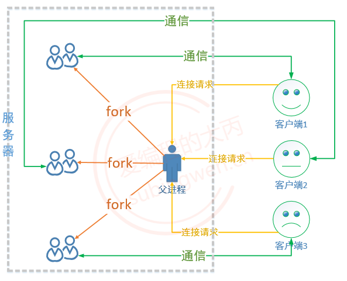
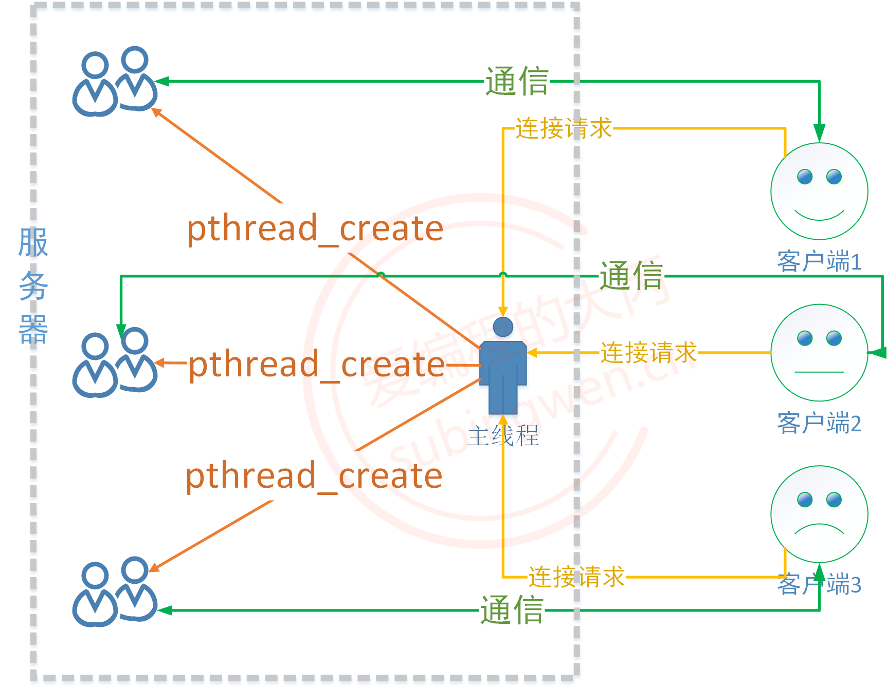

# 服务器并发

## 单线程/进程

在 TCP 通信过程中，服务器端启动之后可以同时和多个客户端建立连接，并进行网络通信，但是在介绍 `README/TCP通信流程`的时候，提供的服务器代码却不能完成这样的需求：

代码中用到了三个会引起程序阻塞的函数，分别是：

- `accept()`：如果服务器端没有新客户端连接，阻塞当前进程 / 线程，如果检测到新连接解除阻塞，建立连接
- `read()`：如果通信的套接字对应的读缓冲区没有数据，阻塞当前进程 / 线程，检测到数据解除阻塞，接收数据
- `write()`：如果通信的套接字写缓冲区被写满了，阻塞当前进程 / 线程（这种情况比较少见）

如果需要和发起新的连接请求的客户端建立连接，那么就必须在服务器端通过一个循环调用 accept() 函数，另外已经和服务器建立连接的客户端需要和服务器通信，发送数据时的阻塞可以忽略，当接收不到数据时程序也会被阻塞，这时候就会非常矛盾，被 accept() 阻塞就无法通信，被 read() 阻塞就无法和客户端建立新连接。

因此得出一个结论，基于上述处理方式，在单线程 / 单进程场景下，服务器是无法处理多连接的，解决方案也有很多：

- 使用多线程实现
- 使用多进程实现
- 使用 IO 多路复用（转接）实现
- 使用 IO 多路复用+ 多线程实现


## 多进程并发

如果要编写多进程版的并发服务器程序，首先要考虑，创建出的多个进程都是什么角色，这样就可以在程序中对号入座了。

在TCP服务器端一共有两个角色，分别是：监听和通信。监听是一个持续的动作，如果有新连接就建立连接，如果没有新连接就阻塞。关于通信是需要和多个客户端同时进行的，因此需要多个进程，这样才能达到互不影响的效果。进程也有两大类：父进程和子进程，通过分析我们可以这样分配进程：

父进程：负责监听，处理客户端的连接请求，也就是在父进程中循环调用 accept() 函数

- 创建子进程：建立一个新的连接，就创建一个新的子进程，让这个子进程和对应的客户端通信
- 回收子进程资源：子进程退出回收其内核 PCB 资源，防止出现僵尸进程

子进程：负责通信，基于父进程建立新连接之后得到的文件描述符，和对应的客户端完成数据的接收和发送。

- 发送数据：send() / write()
- 接收数据：recv() / read()

在多进程版的服务器端程序中，多个进程是有血缘关系，对应有血缘关系的进程来说，还需要想明白他们有哪些资源是可以被继承的，哪些资源是独占的，以及一些其他细节：

- 子进程是父进程的拷贝，在子进程的内核区 PCB 中，文件描述符也是可以被拷贝的，因此在父进程可以使用的文件描述符在子进程中也有一份，并且可以使用它们做和父进程一样的事情。

- 父子进程有用各自的独立的虚拟地址空间，因此所有的资源都是独占的

- 为了节省系统资源，对于只有在父进程才能用到的资源，可以在子进程中将其释放掉，父进程亦如此。

- 由于需要在父进程中做 accept() 操作，并且要释放子进程资源，如果想要更高效一下可以使用信号的方式处理




```cpp
#include <arpa/inet.h>
#include <errno.h>
#include <pthread.h>
#include <signal.h>
#include <stdio.h>
#include <stdlib.h>
#include <string.h>
#include <sys/socket.h>
#include <sys/stat.h>
#include <unistd.h>
#include <wait.h>

const char* IP = "0.0.0.0";  // 服务器IP地址一般设置成本地所有IP，不需要改动
const int PORT = 9821;  // 服务器开放的端口号

// 发送和接收缓冲区
char send_buf[1024];
char recv_buf[1024];
int val = 1;  // 套接字配置函数所使用的值

// 信号处理函数
void callback(int num) {
  while (1) {
    // 非阻塞回收所有子进程资源，成功返回子进程pid
    pid_t pid = waitpid(-1, nullptr, WNOHANG);
    if (pid <= 0) {
      printf("子进程正在运行，或者子进程被回收完毕了\n");
      break;
    }
    printf("child die, pid=%d\n", pid);
  }
}

// 子进程工作函数
int childWork(int cfd) {
  memset(send_buf, 0, sizeof(send_buf));
  memset(recv_buf, 0, sizeof(recv_buf));

  // 阻塞接收客户端发来的消息
  int len = recv(cfd, recv_buf, sizeof(recv_buf), 0);

  // 打印接受到的数据
  printf("Server recv: %s\n", recv_buf);

  // 给客户端回复ok!!!
  strcpy(send_buf, "OK!!!");
  send(cfd, send_buf, strlen(send_buf), 0);

  // 如果收到的是exit则退出
  if (strcmp(recv_buf, "exit") == 0) {
    return 0;
  }
  return len;
}

int main(int argc, const char* argv[]) {
  /* 1. 设置服务器地址为任意IP，和开放的端口号 */
  struct sockaddr_in server_addr;
  server_addr.sin_family = AF_INET;
  server_addr.sin_port = htons(PORT);  //设置服务器端口，必须是没有被占用的端口
  inet_pton(AF_INET, IP,
            &server_addr.sin_addr.s_addr);  //服务器IP设置为本地所有的IP

  /* 2. 创建监听的套接字 */
  int lfd = socket(AF_INET, SOCK_STREAM, 0);
  if (lfd == -1) {
    perror("socket");
    exit(0);
  }
  /* 2.1 配置套接字，实现端口复用 */
  setsockopt(lfd, SOL_SOCKET, SO_REUSEADDR, (void*)&val, sizeof(val));

  /*3. 将套接字和服务器地址绑定*/
  int ret = bind(lfd, (struct sockaddr*)&server_addr, sizeof(server_addr));
  if (ret == -1) {
    perror("bind");
    exit(0);
  }

  /* 4. 监听套接字，并允许最大连接数为64 */
  ret = listen(lfd, 3);
  if (ret == -1) {
    perror("listen");
    exit(0);
  }

  /* 注册信号的捕捉 */
  struct sigaction act;
  act.sa_flags = 0;
  act.sa_handler = callback;
  sigemptyset(&act.sa_mask);
  sigaction(SIGCHLD, &act, nullptr);

  // 接受多个客户端连接，需要循环调用 accept
  while (1) {
    /* 5. 阻塞等待连接请求，　并接受连接请求 */
    struct sockaddr_in client_addr;  // 客户端地址信息
    socklen_t clien_len = sizeof(client_addr);
    int cfd = accept(lfd, (struct sockaddr*)&client_addr, &clien_len);
    if (cfd == -1) {
      if (errno == EINTR) {
        // accept调用信号被中断了，解除阻塞，返回了-1
        // 重新调用一次accept
        continue;
      }

      perror("accept");
      exit(0);
    }

    // 如果有客户端连接，则打印客户端信息：IP地址和端口号
    printf("client iP: %s, port: %d\n",
           inet_ntop(AF_INET, &client_addr.sin_addr.s_addr, recv_buf,
                     sizeof(recv_buf)),
           ntohs(client_addr.sin_port));

    /* 新的连接已经建立了，创建子进程，让子进程和这个客户端通信 */
    pid_t pid = fork();
    if (pid == 0) {
      // 子进程和客户端通信，通信文件描述符cfd被拷贝到子进程中
      // 但子进程不需要负责监听，所以可以关闭监听文件描述符
      close(lfd);
      while (1) {
        int ret = childWork(cfd);
        if (ret <= 0) {
          break;
        }
      }
      // 退出子进程
      close(cfd);
      exit(0);
    } else if (pid > 0) {
      // 父进程不需要和客户端通信，所以关闭通信文件描述符
      close(cfd);
    }
  }

  return 0;
}
```

在上面的示例代码中，父子进程中分别关掉了用不到的文件描述符（父进程不需要通信，子进程也不需要监听）。如果客户端主动断开连接，那么服务器端负责和客户端通信的子进程也就退出了，子进程退出之后会给父进程发送一个叫做 SIGCHLD 的信号，在父进程中通过 `sigaction() `函数捕捉了该信号，通过回调函数 callback() 中的 waitpid() 对退出的子进程进行了资源回收。

另外还有一个细节要说明一下，这是父进程的处理代码：

```cpp
int cfd = accept(lfd, (struct sockaddr*)&client_addr, &clien_len);
if (cfd == -1) {
    if (errno == EINTR) {
        // accept调用信号被中断了，解除阻塞，返回了-1
        // 重新调用一次accept
        continue;
    }

    perror("accept");
    exit(0);
}
```

如果父进程调用` accept()` 函数没有检测到新的客户端连接，父进程就阻塞在这儿了，这时候有子进程退出了，发送信号给父进程，父进程就捕捉到了这个信号 `SIGCHLD`， 由于信号的优先级很高，会打断代码正常的执行流程，因此父进程的阻塞被中断，转而去处理这个信号对应的函数 `callback()`，处理完毕，再次回到 `accept() `位置，但是这是已经无法阻塞了，函数直接返回 `- 1`，此时函数调用失败，错误描述为` accept: Interrupted system call`，对应的错误号为 `EINTR`，由于代码是被信号中断导致的错误，所以可以在程序中对这个错误号进行判断，让父进程重新调用 `accept()`，继续阻塞或者接受客户端的新连接。


## 多线程并发

编写多线程版的并发服务器程序和多进程思路差不多，考虑明白了对号入座即可。多线程中的线程有两大类：主线程（父线程）和子线程，他们分别要在服务器端处理监听和通信流程。根据多进程的处理思路，就可以这样设计了：

主线程：负责监听，处理客户端的连接请求，也就是在父进程中循环调用 accept() 函数

- 创建子线程：建立一个新的连接，就创建一个新的子进程，让这个子进程和对应的客户端通信
- 回收子线程资源：由于回收需要调用阻塞函数，这样就会影响 accept()，直接做线程分离即可。

子线程：负责通信，基于主线程建立新连接之后得到的文件描述符，和对应的客户端完成数据的接收和发送。

- 发送数据：send() / write()
- 接收数据：recv() / read()

在多线程版的服务器端程序中，多个线程共用同一个地址空间，有些数据是共享的，有些数据的独占的，下面来分析一些其中的一些细节：

- 同一地址空间中的多个线程的栈空间是独占的
- 多个线程共享全局数据区，堆区，以及内核区的文件描述符等资源，因此需要注意数据覆盖问题，并且在多个线程访问共享资源的时候，还需要进行线程同步。




```cpp
#include <arpa/inet.h>
#include <pthread.h>
#include <stdio.h>
#include <stdlib.h>
#include <string.h>
#include <sys/socket.h>
#include <sys/stat.h>
#include <unistd.h>

const char* IP = "0.0.0.0";  // 服务器IP地址一般设置成本地所有IP，不需要改动
const int PORT = 9821;  // 服务器开放的端口号
const int MAX = 128;    // 最大线程数

// 发送和接收缓冲区
char send_buf[1024];
char recv_buf[1024];
int val = 1;  // 套接字配置函数所使用的值

typedef struct SockInfo {
  int cfd = -1;             // 通信描述符
  pthread_t tid = -1;       // 线程ID
  struct sockaddr_in addr;  // 地址信息
} SockInfo;

// 创建一个全局数组，保存文件描述符信息
SockInfo infos[MAX];

void* working(void* arg) {
  SockInfo* info_ptr = (SockInfo*)arg;
  // 如果有客户端连接，则打印客户端信息：IP地址和端口号
  printf("client iP: %s, port: %d\n",
         inet_ntop(AF_INET, &info_ptr->addr.sin_addr.s_addr, recv_buf,
                   sizeof(recv_buf)),
         ntohs(info_ptr->addr.sin_port));
  while (1) {
    memset(send_buf, 0, sizeof(send_buf));
    memset(recv_buf, 0, sizeof(recv_buf));

    // 阻塞接收客户端发来的消息
    int len = recv(info_ptr->cfd, recv_buf, sizeof(recv_buf), 0);

    // 打印接受到的数据
    printf("Server recv: %s\n", recv_buf);

    // 给客户端回复ok!!!
    strcpy(send_buf, "OK!!!");
    send(info_ptr->cfd, send_buf, strlen(send_buf), 0);

    // 如果收到的是exit则退出
    if (strcmp(recv_buf, "exit") == 0) {
      info_ptr->cfd = -1;
      break;
    }
  }

  return nullptr;
}

int main(int argc, char const* argv[]) {
  /* 1. 设置服务器地址为任意IP，和开放的端口号 */
  struct sockaddr_in server_addr;
  server_addr.sin_family = AF_INET;
  server_addr.sin_port = htons(PORT);  //设置服务器端口，必须是没有被占用的端口
  inet_pton(AF_INET, IP,
            &server_addr.sin_addr.s_addr);  //服务器IP设置为本地所有的IP

  /* 2. 创建监听的套接字 */
  int lfd = socket(AF_INET, SOCK_STREAM, 0);
  if (lfd == -1) {
    perror("socket");
    exit(0);
  }
  /* 2.1 配置套接字，实现端口复用 */
  setsockopt(lfd, SOL_SOCKET, SO_REUSEADDR, (void*)&val, sizeof(val));

  /*3. 将套接字和服务器地址绑定*/
  int ret = bind(lfd, (struct sockaddr*)&server_addr, sizeof(server_addr));
  if (ret == -1) {
    perror("bind");
    exit(0);
  }

  /* 4. 监听套接字，并允许最大连接数为64 */
  ret = listen(lfd, 64);
  if (ret == -1) {
    perror("listen");
    exit(0);
  }

  while (1) {
    SockInfo* info_ptr;
    // 遍历数组，找到一个空闲的文件描述符记录
    // 如果没有，休眠1s重新寻找
    for (int i = 0; i < MAX; ++i) {
      if (infos[i].cfd == -1) {
        info_ptr = &infos[i];
        break;
      }
      if (i == MAX - 1) {
        sleep(1);
        i = -1;
      }
    }

    /* 5. 阻塞等待连接请求，　并接受连接请求 */
    struct sockaddr_in client_addr;  // 客户端地址信息
    socklen_t clien_len = sizeof(client_addr);
    int cfd = accept(lfd, (struct sockaddr*)&info_ptr->addr, &clien_len);
    if (cfd == -1) {
      perror("accept");
      exit(0);
    }

    info_ptr->cfd = cfd;
    pthread_create(&info_ptr->tid, nullptr, working, info_ptr);
    // 线程分离，子线程退出的时候，其占用的内核资源就被系统的其他进程接管并回收了
    pthread_detach(info_ptr->tid);
  }

  close(lfd);

  return 0;
}
```

在编写多线程版并发服务器代码的时候，需要注意父子线程共用同一个地址空间中的文件描述符，因此每当在主线程中建立一个新的连接，都需要将得到文件描述符值保存起来，不能在同一变量上进行覆盖，这样做丢失了之前的文件描述符值也就不知道怎么和客户端通信了。

在上面示例代码中是将成功建立连接之后得到的用于通信的文件描述符值保存到了一个全局数组中，每个子线程需要和不同的客户端通信，需要的文件描述符值也就不一样，**只要保证存储每个有效文件描述符值的变量对应不同的内存地址，在使用的时候就不会发生数据覆盖的现象，造成通信数据的混乱了。**


