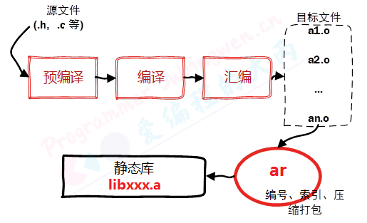
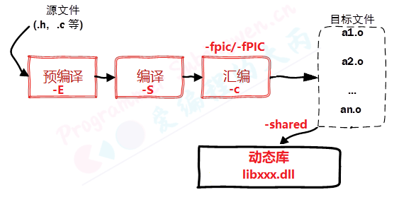
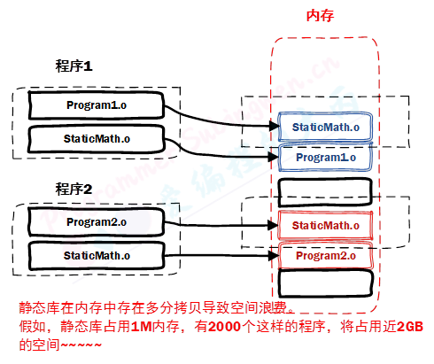
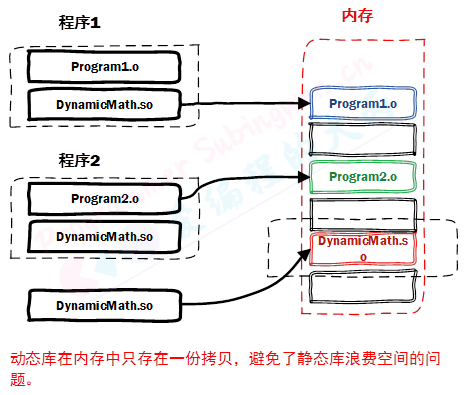

# 静态库和动态库

不管是 Linux 还是 Windows 中的库文件其本质和工作模式都是相同的，只不过在不同的平台上库对应的文件格式和文件后缀不同。程序中调用的库有两种 静态库和动态库，不管是哪种库文件本质是还是源文件，只不过是二进制格式只有计算机能够识别，作为一个普通人就无能为力了。

在项目中使用库一般有两个目的，一个是为了使程序更加简洁不需要在项目中维护太多的源文件，另一方面是为了源代码保密，毕竟不是所有人都想把自己编写的程序开源出来。

当我们拿到了库文件（动态库、静态库）之后**要想使用还必须有这些库中提供的 API 函数的声明**，也就是头文件，把这些都添加到项目中，就可以快乐的写代码了。


## 静态库

在 Linux 中静态库由程序 `ar` 生成，**现在静态库已经不像之前那么普遍了，这主要是由于程序都在使用动态库。**关于静态库的命名规则如下:

- 在 Linux 中静态库以 lib 作为前缀，以.a 作为后缀，中间是库的名字自己指定即可，即: `libxxx.a`
- 在 Windows 中静态库一般以 lib 作为前后缀，中间是库的名字需要自己指定，即: `libxxx.lib`



### 生成静态链接库

生成静态库，需要先对源文件进行汇编操作 (使用参数 `-c`) 得到二进制格式的目标文件 (`.o `格式), 然后在通过 ar 工具将目标文件打包就可以得到静态库文件了 (`libxxx.a`)。

> 使用 ar 工具创建静态库的时候需要三个参数:
>
> - 参数c：创建一个库，不管库是否存在，都将创建。
> - 参数s：创建目标文件索引，这在创建较大的库时能加快时间。
> - 参数r：在库中插入模块 (替换)。默认新的成员添加在库的结尾处，如果模块名已经在库中存在，则替换同名的模块。

封装一个`Log()`函数，用来打印测试信息。项目目录如下：

```bash
.
├── include
│   └── tools.h
├── main.cpp
└── tools.cpp
```

```cpp
// tools.h
#include <string>
void Log(std::string str);
```

```cpp
// tools.cpp
#include "tools.h"
#include <iostream>
void Log(std::string str) { std::cout << str << std::endl; }
```

```cpp
// main.cpp
#include <iostream>
#include "tools.h"
int main(int argc, char const *argv[]) {
  Log("Debug...");

  return 0;
}
```

第一步：将源文件进行汇编，得到二进制文件`tools.o`

```bash
g++ -c tools.cpp  -I ./include/
```

第二步：将生成的目标文件通过 `ar `工具打包生成静态库`libtools.a`

```bash
ar -rcs libtools.a tools.o
```

第三步：发布。将生成的静态库`libtools.a`和库对应的头文件`tools.h`一并发布给使用者就可以了。

```bash
# 3. 发布静态库
1. tools.h    => 函数声明
2. libtools.a => 函数定义(二进制格式)
```

第四步：静态库的使用。将头文件和静态库与`main.cpp`放在同一文件夹下：

```bash
.
├── libtools.a
├── main.cpp
└── tools.h
```

```bash
# 4. 编译的时候指定库信息
#	-L: 指定库所在的目录(相对或者绝对路径)
#	-l: 指定库的名字, 掐头(lib)去尾(.a) ==> tools
# -L -l, 参数和参数值之间可以有空格, 也可以没有  -L./ -ltools
g++ main.cpp -L ./ -l tools
```


## 动态库

动态链接库是程序运行时加载的库，当动态链接库正确部署之后，运行的多个程序可以使用同一个加载到内存中的动态库，因此在 Linux 中动态链接库也可称之为共享库。

动态链接库是目标文件的集合，目标文件在动态链接库中的组织方式是按照特殊方式形成的。**库中函数和变量的地址使用的是相对地址（静态库中使用的是绝对地址），其真实地址是在应用程序加载动态库时形成的。**

关于动态库的命名规则如下:

- 在 Linux 中动态库以 `lib` 作为前缀，以`.so `作为后缀，中间是库的名字自己指定即可，即: `libxxx.so`
- 在 Windows 中动态库一般以 `lib` 作为前缀，以 `dll` 作为后缀，中间是库的名字需要自己指定，即: `libxxx.dll`

### 生成动态链接库

生成动态链接库是直接使用 gcc 命令并且需要添加 `-fPIC（-fpic）` 以及 `-shared `参数。

- `-fPIC `或 `-fpic `参数的作用是使得 gcc 生成的代码是与位置无关的，也就是使用相对位置。
- `-shared`参数的作用是告诉编译器生成一个动态链接库。



封装一个`Log()`函数，用来打印测试信息。项目目录和代码和生成静态库一样。

第一步：将源文件进行汇编 (参数-c), 生成与位置无关的目标文件，需要使用参数 `-fpic`或者`-fPIC`

```bash
g++ -c tools.cpp -fpic -I ./include/
```

第二步：将得到的目标文件打包生成动态库，需要使用参数 `-shared`

```cpp
g++ -shared tools.o -o libtools.so
```

第三步：发布生成的动态库和相关的头文件

```bash
# 3. 发布库文件和头文件
1. tools.h
2. libt.so
```

第四步：静态库的使用。将头文件和动态库与main.cpp放在同一文件夹下：

```bash
g++ main.cpp -L ./ -l tools

# ./a.out: error while loading shared libraries: libtools.so: cannot open shared object file: No such file or directory
```


### 静态库加载

在程序编译的最后一个阶段也就是**链接**阶段，**提供的静态库会被打包到可执行程序中**。当可执行程序被执行，静态库中的代码也会一并被加载到内存中，因此不会出现静态库找不到无法被加载的问题。

### 动态库加载

**在程序编译的最后一个阶段也就是链接阶段：**

- 在 gcc 命令中虽然指定了库路径 (使用参数` -L `), 但是这个路径并没有记录到可执行程序中，只是检查了这个路径下的库文件是否存在。
- 同样对应的动态库文件也没有被打包到可执行程序中，只是在可执行程序中记录了库的名字。

**可执行程序被执行起来之后：**

- 程序执行的时候会先检测需要的动态库是否可以被加载，加载不到就会提示上边的错误信息。
- 当动态库中的函数在程序中被调用了, 这个时候动态库才加载到内存，如果不被调用就不加载。
- 动态库的检测和内存加载操作都是由**动态连接器**来完成的。

### 动态链接器

动态链接器是一个独立于应用程序的进程，属于操作系统。当用户的程序需要加载动态库的时候动态连接器就开始工作了，很显然动态连接器根本就不知道用户通过 gcc 编译程序的时候通过参数 -L 指定的路径。

那么动态链接器是如何搜索某一个动态库的呢，在它内部有一个默认的搜索顺序，按照优先级从高到低的顺序分别是：

- 可执行文件内部的 `DT_RPATH` 段

- 系统的环境变量` LD_LIBRARY_PATH`

- 系统动态库的缓存文件 `/etc/ld.so.cache`

- 存储动态库 / 静态库的系统目录` /lib/`,` /usr/lib` 等


按照以上四个顺序，依次搜索，找到之后结束遍历，最终还是没找到，动态连接器就会提示动态库找不到的错误信息。


## 解决动态库无法加载问题

可执行程序生成之后，根据动态链接器的搜索路径，我们可以提供三种解决方案，我们只需要将动态库的路径放到对应的环境变量或者系统配置文件中，同样也可以将动态库拷贝到系统库目录。

### Plan A

**将库路径添加到环境变量 LD_LIBRARY_PATH 中**

1、使用Vim打开相关的配置文件

* 用户级别: `~/.bashrc` —> 设置对当前用户有效
* 系统级别: `/etc/profile` —> 设置对所有用户有效

```bash
# 自己把路径写进去就行了
export LD_LIBRARY_PATH=$LD_LIBRARY_PATH:/root/workspace/test/	# 替换成动态链接库所在路径
```

2、让修改的配置文件生效

```bash
# 修改的是哪一个就执行对应的那个命令
# source 可以简写为一个 . , 作用是让文件内容被重新加载
source ~/.bashrc		# 或者 . ~/.bashrc
source /etc/profile		# 或者 . /etc/profile
```


### Plan B

**更新 `/etc/ld.so.cache` 文件**

1、使用Vim打开配置文件

```bash
vim /etc/ld.so.conf
```

2、添加动态链接库所在路径，单独占一行

```bash
include ld.so.conf.d/*.conf
/root/workspace/test/
```

3、让配置文件生效

```bash
# 必须使用管理员权限执行这个命令
sudo ldconfig   
```

### Plan C

**拷贝动态库文件到系统库目录` /lib/ `或者` /usr/lib` 中**

```bash
# 库拷贝
sudo cp /xxx/xxx/libxxx.so /usr/lib

# 必须使用管理员权限执行这个命令
sudo ldconfig   
```


### 验证

在启动可执行程序之前，或者在设置了动态库路径之后，我们可以通过一个命令检测程序能不能够通过动态链接器加载到对应的动态库，这个命令叫做 `ldd`

```bash
ldd 可执行程序名
```


## 优缺点

| 静态库                                                       | 动态库                                                     |
| ------------------------------------------------------------ | ---------------------------------------------------------- |
| 静态库被打包到应用程序中加载速度快                           | 可实现不同进程间的资源共享                                 |
| 发布程序无需提供静态库，移植方便                             | 动态库升级简单，只需要替换库文件，无需重新编译应用程序     |
| 相同的库文件数据可能在内存中被加载多份，消耗系统资源，浪费内存 | 程序猿可以控制何时加载动态库，不调用库函数动态库不会被加载 |
| 库文件更新需要重新编译项目文件，生成新的可执行程序，浪费时间。 | 加载速度比静态库慢，以现在计算机的性能可以忽略             |
|                                                              | 发布程序需要提供依赖的动态库                               |






