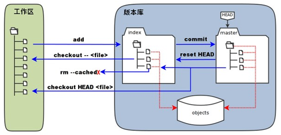

# Git

> 学习 Git 时记录的一些笔记。随着学习的不断深入，会不断对文章进行修改。

## 基本概念

### 本地仓库

工作区：工作区就是我们能看到的目录，它持有实际文件。

版本库：工作区有一个隐藏目录.git，这个不是工作区，是 Git 的版本库。版本库里会有暂存区，以及 Git 自动创建的第一个分支 master，以及指向 master 的一个指针叫 HEAD。

暂存区，stage（或者叫 index），存放在 ".git 目录下" 下的 index 文件（.git/index）中。它像个缓存区域，临时保存你的改动；

HEAD，它指向你最后一次提交的结果。



可以说，版本控制的本质就是对文件版本的控制。对文件进行各种操作的前提是，明确文件所在的状态。在 git 中通过`git status`指令来查看当前所有文件的状态。若你的版本库与工作区的文件快照完全相同，即所有文件均处于`Unmodify`状态，则执行`git status`会提示：`working tree clean`。

### 文件状态

**Untracked：**未跟踪：此文件存在于项目文件夹中，但并未添加到版本库，所以不会参与版本控制，使用`git add filename`指令来将文件状态转换为 Staged。

**Unmodify：**文件已入版本库，未修改，也就是说该文件与版本库中文件快照完全一致。这种状态下的文件有两种去处：使用`git rm filename`指令来将文件移出版本库，状态变为 Untracked；或者修改该文件，状态变为 Modified。

**Modified：**文件已经被修改（仅是修改，并无其它操作），意味着该文件与版本库的文件快照不相同，这种状态下的文件也有两种去处：使用指令`git add filename` 将该文件存入暂存区，状态变为 Staged；或者使用指令`git checkout`丢弃修改，状态变为 Unmodify。

**Staged：**暂存状态，文件被储存在暂存区。使用指令`git commit`将文件提交到版本库，状态变为 Unmodify；或者使用指令`git reset HEAD filename`来取消暂存状态，状态变为 Modified。

## 基本命令

### 全局配置

```bash
git config --global user.name "用户名"
git config --global user.email "邮箱"
```

```shell
# 生成SSH密钥
ssh-keygen -t rsa -b 4096 -C "xxx@gmail.com"
```

### 检查仓库状态 Git status

`git status` 命令显示工作目录和缓存区的状态。你可以看到哪些更改被缓存了，哪些还没有，以及哪些还未被 Git 追踪。status 的输出**不会**告诉你任何已提交到项目历史的信息。如果你想看的话，应该使用 `git log` 命令。

```bash
git status		# 列出已缓存、未缓存、未追踪的文件
```

### 查看历史提价 Git log

有一些有用的选项。`--graph` 标记会绘制一幅字符组成的图形，左边是提交，右边是提交信息。`--decorate` 标记会加上提交所在的分支名称和标签。`--oneline` 标记将提交信息显示在同一行，一目了然。

```shell
git log					# 查看日志信息
git log --decorate --oneline --graph --all   # 以图形的形式显示分支信息
git log --oneline		# 将每个提交压缩到一行。当你需要查看项目历史的上层情况时这会很有用。
```

用 git log 可以查看提交历史。如果觉得太繁琐，可以用 git log --pretty=oneline，只显示版本号和提交的备注信息。

用 git reflog 可以查看所有分支的所有操作记录（包括已经被删除的 commit 记录和 reset 的操作）。

### diff 比较命令

```c
git diff
//比较工作目录和暂存区域的
```

```bash
   HP@QiuYeYiJian MINGW64 /f/GitPractice/myproject (master)
   $ git diff
   diff --git a/README.md b/README.md   //比较暂存区域的README和工作目录的README
   index 0cb0ebd..1be4651 100644        //文件id 权限
   --- a/README.md                      //旧文件，存放在暂存区域的文件
   +++ b/README.md                      //新文件，存放在工作目录的文件
   @@ -1 +1,2 @@                        //-1：旧文件开始的行数，+1：新文件开始的行数，2：连续的行号
   -this is a big project
   \ No newline at end of file          //文件不是以换行符结束
   +this is a big project
   +qiuyeyijian
   \ No newline at end of file
   diff --git a/game.py b/game.py
   index e69de29..8671739 100644
   --- a/game.py
   +++ b/game.py
   @@ -0,0 +1 @@
   +print（"hello,world");
   \ No newline at end of file
```

## 基本操作

### 创建代码仓库的两种方法

在本地创建仓库一般有两种方法：

- 手动从 0 到 1 创建，并关联远程仓库。此方法较为麻烦，但在一些场合十分有用。
- 直接克隆已有的远程仓库到本地。此方法常用，简单易行。

这两种方法都要求在 Github 提前创建远程仓库，为了演示方便，博主在 Github 上创建了一个测试仓库。

测试仓库地址：`git@github.com:qiuyeyijian/test.git`

#### 手动创建

1. 新建一个文件夹，然后进入到此文件夹下并打开终端
2. 初始化 Git

```shell
git init
```

3. 关联一个远程仓库，命名为`origin`，默认仓库以此命名。

```shell
git remote add origin git@github.com:qiuyeyijian/test.git

git remote -v		# 查看是否添加成功
git remote rm origin		# 删除关联
```

4. 同步远程所有分支

```shell
git fetch --all				# 此时只是同步分支信息而已

git pull origin master		# 拉取远程主分支，此时会拉取远程分支master中的所有文件
```

5. 将远程的主分支和我们本地的主分支关联起来

```shell
git branch --set-upstream-to=origin/master
```

> 说明：
>
> `git branch --set-upstream-to=<remote>/<branch> master`
>
> - remote 改成之前我们设置的远程仓库的名字，然后 branch 换成远程仓库的分支
> - master 是本地的 master 分支

至此创建完成，接下来就可以在此文件夹下编写代码并提交 Github，如何提交接下来也会说明。

#### 直接克隆远程分支到本地

```shell
git clone git@github.com:qiuyeyijian/test.git
```

Git 为了能进行版本控制，方便进行版本回退，会将用户所有修改记录保存到`.git` 文件夹下，时间久了就会导致记录文件很大。我们在克隆下载别人仓库的时候，可以只克隆最近一次提交记录即可，可以加快下载速度。只需要在后面加上`--depth 1`参数即可。

```shell
git clone git@github.com:qiuyeyijian/test.git --depth=1
```

### 提交远程仓库

我们在本地仓库编辑好代码后，就可以提交到远程仓库了，具体流程如下：

1. 添加所有修改到暂存区，注意 add 后面的点

```shell
git add .
```

2. 为你的修改做一些说明

```shell
git commit -m "first commit"    //将first commit 替换成你的一些说明
```

3. 推送到远程仓库的`master`分支

```shell
git push origin master

# 可以简写成，因为origin是默认远程仓库，master是默认主分支
git push
```

### 同时关联 Github 和 Gitee 远程仓库

利用`创建本地仓库`方法，我们的本地仓库已经关联了 Github 远程仓库，接下来将演示如何再添加一个 Gitee 远程仓库。博主已经提前在 Gitee 上创建好了测试仓库：`git@gitee.com:qiuyeyijian/test.git`

1. 添加 Gitee 远程仓库

```bash
git remote add gitee git@gitee.com:qiuyeyijian/test.git
```

> 说明：
>
> `git remote add <远程仓库名> url`
>
> - **远程仓库名**可以随便起，容易记就行。
> - url 可以是 `https://`形式的，如果你添加了 ssh，就可以使用上面那种形式

2. 使用`git remote -v`查看所有远程分支，配置成功会出现：

```bash
gitee   git@gitee.com:qiuyeyijian/test.git (fetch)
gitee   git@gitee.com:qiuyeyijian/test.git (push)
origin  git@github.com:qiuyeyijian/test.git (fetch)
origin  git@github.com:qiuyeyijian/test.git (push)
```

3. 同步远程所有分支，即同步 Gitee 和 Github 所有分支

```bash
git fetch --all
```

```bash
git pull gitee master --allow-unrelated-histories	# 拉取Gitee的master仓库分支内容
```

> 说明：
>
> - 拉取 gitee 上的远程分支，后面加的命令的意思是忽略版本不同，不然会报错`fatal: refusing to merge unrelated histories`
> - 如果有冲突的话就直接解决冲突，不在赘述

4. 至此，Gitee 远程仓库已经添加完毕。之后我们需要提交到远程仓库时：

- 提交到 Github

```shell
git push origin master		 #可以简写 git push
```

- 提交到 Gitee

```shell
git push gitee master		# 可以简写 git push gitee
```

### 克隆 X 的项目，一段时间后再次同步 X 的提交信息

1. 进入到自己项目，打开终端
2. 添加原作者的远程仓库地址，习惯命名`upstream`，当然也可以自定义其他

```shell
# git remote add [远程仓库名] [远程仓库地址]
git remote add upstream git@github.com:qiuyeyijian/Notes.git
```

3. 将原作者仓库的所有分支同步到本地

```shell
git fetch upstream
```

4. 将其中一个分支，比如`upstream/master`合并到自己本地的`master`分支

```shell
git checkout master
git merge upstream/master
```

5. 提交到自己的 Github 远程托管分支

```shell
git push
```

## 分支管理

### 创建分支

```shell
git branch <分支名>                            # 创建分支
git checkout <分支名>                          # 切换分支
git checkout -b <分支名>                       # 创建并切换分支
git branch -a								  # 查看所有分支
```

### 合并分支

master 指针指向版本，HEAD 指向 master，每次提交 master 都会向前移一步，而 HEAD 跟随 master 移动。现在创建一个新的分支 dev，Git 就会新建一个指针 dev，并指向 master 指向的内容，并且把 HEAD 指向 dev，表示 dev 是当前使用的分支。那么此时，我们在工作区的修改和提交就会在 dev 分支上进行，每一次提交，dev 分支就会向前移动一步，而 master 分支不变。如果 dev 分支上的内容开发完毕，就需要合并两个分支，最简单的方法就是直接将 master 的指针指向 dev 分支指向的内容。 master 指针指向版本，HEAD 指向 master，每次提交 master 都会向前移一步，而 HEAD 跟随 master 移动。现在创建一个新的分支 dev，Git 就会新建一个指针 dev，并指向 master 指向的内容，并且把 HEAD 指向 dev，表示 dev 是当前使用的分支。那么此时，我们在工作区的修改和提交就会在 dev 分支上进行，每一次提交，dev 分支就会向前移动一步，而 master 分支不变。如果 dev 分支上的内容开发完毕，就需要合并两个分支，最简单的方法就是直接将 master 的指针指向 dev 分支指向的内容。

场景：假如我们在本地仓库创建一个`dev`分支，并在此分支下开发软件，完成后提交的远程仓库。现在我们希望将`dev`分支合并到`master`主分支。

```shell
git checkout -b dev			# 创建dev分支，在此分支下开发程序

git add . 					# 将程序提交到暂存区
git commit -m "dev"			# 编写提交信息
git push		            # 推送到远程仓库的dev分支

git checkout master			# 切换到主分支
git merge dev				# 将dev合并到主分支，如果遇到冲突就解决
git push					# 合并完成推送到远程仓库
```

另外可以使用下面命令创建一个匿名分支。可以用来做实验，切换到主分支后，匿名分支不会保存。

```shell
git checkout HEAD~
```

### 删除分支

```bash
git branch -a				# 查看所有分支
git checkout master			# 切换到主分支
git branch -d dev			# 删除本地分支
git push origin --delete dev	# 删除远程分支
git branch -a				# 查看所有分支
```

如果报错：

```bash
error: unable to delete 'dev': remote ref does not exist
```

说明 remote 端已经删掉（比如在合并 master 时删除了），为什么用 git branch -av 还是能看到呢？ 其实我们看到的，只是前面用 git fetch 保存到本地的缓存信息而已。可以执行命令：

```bash
git fetch --prune origin
# 或者 git fetch --p origin
```

这时候，再执行 git branch -a ，已经看不到 remote 的 dev 这个分支了

### 重命名分支

**本地分支重命名**

```shell
git branch -m old-name new-name
```

**远程分支重命名**

> - 1、将远程分支删除掉
> - 2、将本地分支重命名
> - 3、将本地分支推到远程

比如：将远程的 dev 重命名为 develop

```cpp
git push --delete origin dev
git branch -m dev develop
git push origin develop
```

### 拉取指定分支

```bash
git fetch origin dev
git pull --all
```

## 进阶操作

### 修改最后一次提交

```c
git commit --amend
```

### 删除文件

```bash
git rm <file name>
git reset --soft HEAD~                      //回退当前指针
git rm -f <file name>                       //暴力删除工作目录和暂存区的文件
git rm --cached <file name>                 //只删除暂存区域的文件
```

### 解决合并冲突

```bash
git status         //查看状态
cat <file name>    //查看冲突文件
vi  <file name>    //修复冲突文件
git add <file>     //单独添加冲突文件
git commit -m "confict fixed"   //提交
git log --graph --pretty=oneline --abbrev-commit          //查看分支合并情况
```

### 忽略某些文件

首先在 git 仓库下新建一个`.gitignore`文件，然后在里面添加你想忽略的目录，一行代表一个规则。然后提交到远程仓库。

```bash
git rm -r --cached .				//注意后面的点，意思是删除全部缓存，
git commit -a -m "添加忽略文件“
git push
```

## Tag 标签

```bash
git tag					# 查看标签
git tag <标签名称>		 # 创建一个标签
git tag -a <标签名称>	 # 创建一个带注解的标签，会打开编辑器输入
git tag -a <标签名称> -m "注解信息"	# 创建一个带注解的标签，直接指定注解信息
git tag -d 标签名	 	  # 删除本地标签
git push origin 标签名   # 推送远程标签
```

## 版本回退

### reset

```bash
git log --pretty
git reset --hard commit_id
git push origin HEAD --force
```

开发中建议使用`git revert`

### revert

git revert 命令用来撤销某次操作，此次操作之前和之后的 commit 和 history 都会保留，并且把这次撤销作为一次最新的提交。

### 撤销 reset 本身操作

1、查看所有操作日志

```bash
git reflog show
# 或者
git log -g
```

2、恢复到一个新的分支上

```bash
git branch recover_branch commitid
```

## Commit 提交规范

```
type: description
```

type 是 commit 的类别，只允许如下几种标识。

description 是对本次提交的简短描述。不超过 50 个字符。推荐以动词开头，如： 设置、修改、增加、删减、撤销等。

| type       | description                                                         |
| ---------- | ------------------------------------------------------------------- |
| `fix`      | 修复 bug                                                            |
| `docs`     | 文档相关                                                            |
| `release`  | 发布版本                                                            |
| `update`   | 常规更新项目代码                                                    |
| `feat`     | 特性，功能                                                          |
| `build`    | 构建工具或构建过程等的变动，如：gulp 换成了 webpack，webpack 升级等 |
| `test`     | 增加测试代码                                                        |
| `style`    | 代码格式改变                                                        |
| `revert`   | 撤销上一次的 commit                                                 |
| `chore`    | 日常事务；例行工作                                                  |
| `refactor` | 重构                                                                |

## CHANGELOG 规范

### [版本]（2022-08-08）

#### Bug Fixes

### Features

## 其他

### 更改默认编辑器

```bash
git config --global --replace core.editor "code --wait"
```
