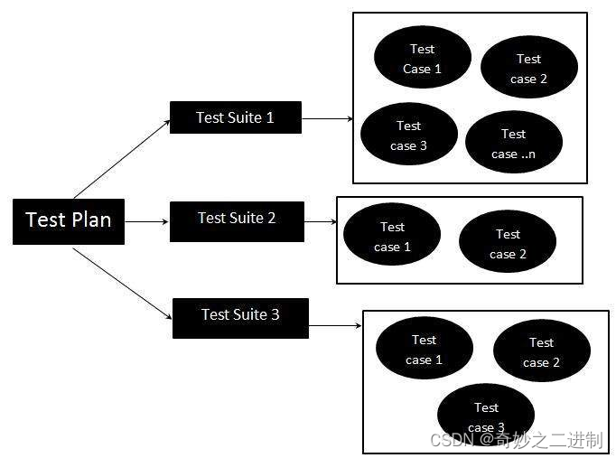

# Gtest

## 简介

Gtest 是 google 开发的一个开源的 C++测试框架，可在 Linux, Windows,Mac 多个平台上对 C++源码进行测试。它提供了丰富的断言，可进行数值型、bool 类型、字符串数据类型、数值检查、异常检查、致命和非致命判断、“死亡测试”等等。

使用 Gtest 本质就是编写断言（assertions），断言语句会检测条件是否为真。**一个断言可存在三种结果：success（成功），nonfatal failure（非致命失败）和 fatal failure（致命失败）。**当出现致命失败时，终止当前函数；否则程序继续执行。



### 测试用例和测试特例

> **测试用例（Test Case）是为某个特殊目标而编制的一组测试输入、执行条件以及预期结果，以便测试某个程序路径或核实是否满足某个特定需求**
>
> **测试特例是测试用例下的一个或多个测试。**

对于一个模块的测试可以设计多个测试用例（test suite），每个测试用例下面又可以设计多个测试特例（test），每个测试特例里面编写断言语句来检测代码质量。

如果一个 test 出现崩溃或有一个失败的断言，则该 test 是 fails，否则是 succeeds。。当一个 test suite 中的多个 test 需要共享一些通用对象和子程序时，可将其放入一个测试套件（Test Fixtures），具体请看宏测试下面的`TEST_F`宏。

> [最新版本将SetUpTestCase变成了SetUpTestSuite](https://github.com/google/googletest/commit/3a460a26b7a91abf87af7f31b93d29f930e25c82)

```cpp
#include <gtest/gtest.h>
#include <gtest/gtest-param-test.h>

class CTestEnvironment : public testing::Environment
{
public:
	CTestEnvironment()
	{
		//仅仅是类的初始化函数，可以在这里做一些成员变量的初始化。
		//具体测试业务的初始化在SetUp中编写
	}
	virtual ~CTestEnvironment()
	{
	}

public:
	virtual void SetUp();
	virtual void TearDown();
};


class CTestFixture : public ::testing::Test
{
public:
	CTestFixture()
	{
	}
	~CTestFixture()
	{
	}
protected:
	virtual void SetUp();
	virtual void TearDown();
	static void SetUpTestSuite();
	static void TearDownTestSuite();
};

void CTestEnvironment::SetUp()
{

}

void CTestEnvironment::TearDown()
{

}

void CTestFixture::SetUpTestSuite()
{
	printf("\n\nCTestFixture: start before executing the first testcase\n\n");
}

void CTestFixture::TearDownTestSuite()
{
	printf("\n\nCTestFixture: start after executing the last testcase\n\n");
}

void CTestFixture::SetUp()
{
	printf("\n\nCTestFixture: start before executing every testcase\n\n");
}

void CTestFixture::TearDown()
{
	printf("\n\nCTestFixture: start after executing every testcase\n\n");
}

int main(int argc, char* argv[]) {
    // 创建测试环境
     ::testing::AddGlobalTestEnvironment(new CTestEnvironment);
    ::testing::GTEST_FLAG(output) = "xml:";
    
    // gtest的测试案例允许接收一系列的命令行参数，因此，我们将命令行参数传递给gtest，进行一些初始化操作。
    ::testing::InitGoogleTest(&argc, argv);

    // RUN_ALL_TESTS() 运行所有的测试用例
    return RUN_ALL_TESTS();
}
```

测试用例名和测试特例名的分开，使得我们编写的测试代码有着更加清晰的结构——即有相关性也有独立性。

相关性是通过相同的测试用例名联系的，而独立性通过不同的测试特例名体现的。

### 测试用例运行入口

RUN_ALL_TESTS()这个宏，从名字上来看，就是运行所有的测试用例，这才是我们运行测试用例的真正入口。它的原型是：

```cpp
inline int RUN_ALL_TESTS() {
  return ::testing::UnitTest::GetInstance()->Run();
}
```

RUN_ALL_TESTS()是一个宏，将其实现为函数，在这里，调用了 UnitTest 单例的 Run 函数，看调用过程，可以看到，依次调用的过程是

1. UnitTest::Run()

2. UnitTestImpl::RunAllTests()

3. TestCase::Run()

4. TestInfo::Run()

5. Test::Run()

## 安装

### Linux

```bash
sudo apt-get install libgtest-dev
```

安装完成之后，就可以在项目中使用 gtest 了。之后使用`g++`编译，注意后面需要加上`-lgtest`和`-lpthread`

```bash
g++ test.cpp -lgtest -lpthread
```

也可以使用 CMake

```cmake
cmake_minimum_required(VERSION 3.0.0)
project(demo01)

add_executable(main main.cpp)
target_link_libraries(main gtest pthread)
```

## 断言

一般的，要测试一个方法（函数）是否是正常执行的，可以提供一些输入数据，在调用这个方法（函数）后，得到输出数据，然后检查输出的数据是否与我们期望的结果是一致的，若一致，则说明这个方法的逻辑是正确的，否则，就有问题。 在对输出结果进行检查（check）时，GTest 为我提供了一系列的断言（assertion）来进行代码测试，断言是一组用于测试函数和类的功能的宏，分为两种：致命断言(`ASSERT_`系列)和非致命断言(`EXPECT_`系列)。

`ASSERT_`系列断言会在失败时产生致命错误并**中止当前调用它的函数执行（注意不是当前测试用例，当前测试用例的其他函数调用会继续执行）**。而`EXPECT_`会生成非致命错误，不会中止当前函数，而是继续执行当前函数。通常情况应该首选使用`EXPECT_`，因为`ASSERT_`在报告完错误后不会进行清理工作，有可能导致内容泄露问题。

> ASSERT 系列断言通常用于比较函数返回值来确认函数是否正常运行，这种情况下，如果函数本身都无法正常运行，那么后面的其余测试可能就没有测试的必要了。而 EXPECT 系列断言则用于在测试用例中收集更多的错误，提升测试的效率。

这些宏有点类似于函数调用。当断言失败时 GTest 将会打印出 assertion 时的源文件和出错行的位置，以及附加的失败信息。这些输出的附加信息用户可以直接通过操作符`<<`加在这些断言宏后面。 如：

```cpp
EXPRCT_TRUE(bFlag) << " bFlag  is false";
```

### 真值断言

| Fatal assertion          | Nonfatal assertion       | Verifies           |
| ------------------------ | ------------------------ | ------------------ |
| ASSERT_TRUE(condition);  | EXPECT_TRUE(condition);  | condition is true  |
| ASSERT_FALSE(condition); | EXPECT_FALSE(condition); | condition is false |

### 二值断言

一般来说二进制比较，都是对比其结构体所在内存的内容。C++大部分原生类型都是可以使用二进制对比的。但是对于自定义类型，我们就要定义一些操作符的行为，比如=、<等。

| Fatal assertion       | Nonfatal assertion    | Verifies     |
| --------------------- | --------------------- | ------------ |
| ASSERT_EQ(val1,val2); | EXPECT_EQ(val1,val2); | val1 == val2 |
| ASSERT_NE(val1,val2); | EXPECT_NE(val1,val2); | val1 != val2 |
| ASSERT_LT(val1,val2); | EXPECT_LT(val1,val2); | val1 < val2  |
| ASSERT_LE(val1,val2); | EXPECT_LE(val1,val2); | val1 <= val2 |
| ASSERT_GT(val1,val2); | EXPECT_GT(val1,val2); | val1 > val2  |
| ASSERT_GE(val1,val2); | EXPECT_GE(val1,val2); | val1 >= val2 |

### 字符串断言

| Fatal assertion              | Nonfatal assertion           | Verifies                                                |
| ---------------------------- | ---------------------------- | ------------------------------------------------------- |
| ASSERT_STREQ(str1,str2);     | EXPECT_STREQ(str1,str2);     | the two C strings have the same content                 |
| ASSERT_STRNE(str1,str2);     | EXPECT_STRNE(str1,str2);     | the two C strings have different content                |
| ASSERT_STRCASEEQ(str1,str2); | EXPECT_STRCASEEQ(str1,str2); | the two C strings have the same content, ignoring case  |
| ASSERT_STRCASENE(str1,str2); | EXPECT_STRCASENE(str1,str2); | the two C strings have different content, ignoring case |

### 浮点数断言

在对比数据方面，我们往往会讨论到浮点数的对比。因为在一些情况下，浮点数的计算精度将影响对比结果，所以这块都会单独拿出来说。GTest 对于浮点数的对比也是单独的。

| Fatal assertion               | Nonfatal assertion            | Verifies                               |
| ----------------------------- | ----------------------------- | -------------------------------------- |
| ASSERT_FLOAT_EQ(val1, val2);  | EXPECT_FLOAT_EQ(val1, val2);  | the two float values are almost equal  |
| ASSERT_DOUBLE_EQ(val1, val2); | EXPECT_DOUBLE_EQ(val1, val2); | the two double values are almost equal |

almost euqal 表示两个数只是近似相似，默认的是是指两者的差值在 4ULP 之内（Units in the Last Place）。我们还可以自己制定精度。

| Fatal assertion                     | Nonfatal assertion                  | Verifies                                                                     |
| ----------------------------------- | ----------------------------------- | ---------------------------------------------------------------------------- |
| ASSERT_NEAR(val1, val2, abs_error); | EXPECT_NEAR(val1, val2, abs_error); | the difference between val1 and val2 doesn’t exceed the given absolute error |

```cpp
ASSERT_NEAR(-1.0f, -1.1f, 0.2f);
ASSERT_NEAR(2.0f, 3.0f, 1.0f);
```

### 成功和失败断言

该类断言用于直接标记是否成功或者失败。可以使用`SUCCEED()`宏标记成功，使用`FAIL()`宏标记致命错误（同`ASSERT_`)，`ADD_FAILURE()`宏标记非致命错误（同`EXPECT_`）。

我们直接在自己的判断下设置断言。这儿有个地方需要说一下，`SUCCEED()`宏会调用`GTEST_MESSAGE_AT_`宏，从而会影响`TestResult`的`test_part_results`结构体，这也是唯一的成功情况下影响该结构体的地方。

```cpp
if (...) {
  SUCCEED();
}
else {
  FAIL();
}
```

### 异常断言

异常断言是在断言中接收一定类型的异常，并转换成断言形式。

| Fatal assertion                          | Nonfatal assertion                       | Verifies                                        |
| ---------------------------------------- | ---------------------------------------- | ----------------------------------------------- |
| ASSERT_THROW(statement, exception_type); | EXPECT_THROW(statement, exception_type); | statement throws an exception of the given type |
| ASSERT_ANY_THROW(statement);             | EXPECT_ANY_THROW(statement);             | statement throws an exception of any type       |
| ASSERT_NO_THROW(statement);              | EXPECT_NO_THROW(statement);              | statement doesn’t throw any exception           |

下面这组测试特例中，我们预期 ThrowException 在传入 0 时，会返回 int 型异常；传入 1 时，会返回 const char\*异常。传入 2 时，会返回异常，但是异常类型我们并不关心。传入 3 时，不返回任何异常。当然 ThrowExeception 的实现也是按以上预期设计的。

```cpp
void ThrowException(int n) {
    switch (n) {
    case 0:
        throw 0;
    case 1:
        throw "const char*";
    case 2:
        throw 1.1f;
    case 3:
        return;
    }
}

TEST(Base, ThrowException) {
    EXPECT_THROW(ThrowException(0), int);
    EXPECT_THROW(ThrowException(1), const char*);
    ASSERT_ANY_THROW(ThrowException(2));
    ASSERT_NO_THROW(ThrowException(3));
}
```

### 参数名输出断言

在之前的介绍的断言中，如果在出错的情况下，我们会对局部测试相关信息进行输出，但是并不涉及其可能传入的参数**。参数名输出断言，可以把参数名和对应的值给输出出来。**目前版本的 GTest 支持 5 个参数的版本`ASSERT/EXPECT_PRED5`宏。当被测试函数返回 false 的时候才会输出参数信息，返回 true，直接测试通过。

| Fatal assertion                  | Nonfatal assertion               | Verifies                       |
| -------------------------------- | -------------------------------- | ------------------------------ |
| ASSERT_PRED1(pred1, val1);       | EXPECT_PRED1(pred1, val1);       | pred1(val1) returns true       |
| ASSERT_PRED2(pred2, val1, val2); | EXPECT_PRED2(pred2, val1, val2); | pred2(val1, val2) returns true |
| ...                              | ...                              | ...                            |

```cpp
bool cmp(int a, int b) {
    return a > b;
}

TEST(Base, cmp) {
    int a = 5;
    int b = 6;
    ASSERT_PRED2(cmp, a, b);
}
```

测试结果的输出为：

```
error: cmp(a, b) evaluates to false, where
a evaluates to 5
b evaluates to 6
```

### 子过程中使用断言

经过之前的分析，我们可以想到，如果子过程中使用了断言，则结果输出只会指向子过程，而不会指向父过程中的某个调用，如果在父过程中多次调用这个子过程，那么就无法分析是哪一次调用失败。为了便于阅读我们可以使用`SCOPED_TRACE`宏去标记下位置。

```cpp
void Sub(int n) {
    ASSERT_EQ(1, n);
}

TEST(SubTest, Test1) {

    // Sub(2) 产生致命失败，Gtest会打印sub1标记
    SCOPED_TRACE("sub1");
    Sub(2);

    // sub(1) 断言成功，Gtest会和下次断言失败一起打印，没有遇到失败则不打印
    SCOPED_TRACE("sub2");
    Sub(1);

    // sub(3) 产生致命失败，Gtest会的标记打印结果为：
    // sub3
    // sub2
    // sub1
    // 其中sub3是最近产生的失败标记，sub2是上次成功的标记，sub1是上次失败的标记
    // 也就是说，Gtest的标记打印是累积的
    SCOPED_TRACE("sub3");
    Sub(3);
}
```

如果不使用`SCOPED_TRACE`宏来标记，则 Gtest 只会输出错误结果，并不指出是哪一个子过程调用产生的。

我们再注意下 Sub 的实现，其使用了`ASSERT_EQ`断言，该断言并不会影响 Test1 测试特例的运行，其原因就是之前说的，`ASSERT_`系列断言在产生致命错误时，只会终端当前函数的执行， 不会终止当前测试用例的执行。为了消除这种可能存在的误解，GTest 推荐使用在子过程中使用

```cpp
ASSERT_NO_FATAL_FAILURE(statement);
// 或者，显示说明
EXPECT_NO_FATAL_FAILURE(statement);
```

```cpp
void Sub(int n) {
    //ASSERT_EQ(1, n);
    EXPECT_NO_FATAL_FAILURE(ASSERT_EQ(1, n));
    //ASSERT_NO_FATAL_FAILURE(ASSERT_EQ(1, n));
}
```

如果父过程一定要在子过程发生错误时退出怎么办？我们可以使用`::testing::Test::HasFatalFailure()`去判断当前线程中是否产生过错误。

```cpp
TEST(SubTest, Test1) {
    SCOPED_TRACE("A");
    Sub(2);
    // 如果当前进程中产生过错误，就直接返回，所以后面的Sub(3)不会执行
    if (::testing::Test::HasFatalFailure()) return;
    Sub(3);
}
```

### 死亡测试：

这一类断言是用来创建一些可能导致程序崩溃的代码，使用 ASSERT_DEATH/EXPECT_DEATH 可以安全的测试程序是否会按预定的情况崩溃。

## 宏测试

### TEST 宏

TEST 宏是一个很重要的宏，它构成一个测试特例。TEST 宏的第一个参数是 test_case_name（测试用例名），第二个参数是 test_name（测试特例名）。

```cpp
#if !GTEST_DONT_DEFINE_TEST
# define TEST(test_case_name, test_name) GTEST_TEST(test_case_name, test_name)
#endif
```

对于测试用例名和测试特例名，不能有下划线`_`。因为 GTest 源码中需要使用下划线把它们连接成一个独立的类名

```cpp
// Expands to the name of the class that implements the given test.
#define GTEST_TEST_CLASS_NAME_(test_case_name, test_name) \
  test_case_name##_##test_name##_Test
```

这样也就要求，我们不能有相同的“测试用例名和特例名”的组合——否则类名重合。

### TEST_F 宏

`TEST`宏构造的测试用例在测试的时候，每次都需要自己手动填充数据，相对而言比较麻烦。其实我们只要在每个特例执行前，获取一份基础数据（原始数据），然后修改其中本次测试特例关心的一项就可以了。同时这份基础数据不可以在每个测试特例中被修改——**即本次测试特例获取的基础数据不会受之前测试特例对基础数据修改而影响——获取的是一个恒定的数据。**
这个时候我们就需要使用`TEST_F`宏了，`TEST_F`叫作测试套件（Test Fixtures）。

- Test Fixtures 类继承于::testing::Test 类。
- 在类内部使用 public 或者 protected 描述其成员，为了保证实际执行的测试子类可以使用其成员变量（这个我们后面会分析下）
- 在构造函数或者继承于::testing::Test 类中的 SetUp 方法中，可以实现我们需要构造的数据。
- 在析构函数或者继承于::testing::Test 类中的 TearDown 方法中，可以实现一些资源释放的代码（在第 3 步中申请的资源）。

```cpp
#define TEST_F(test_fixture, test_name)\
  GTEST_TEST_(test_fixture, test_name, test_fixture, \
              ::testing::internal::GetTypeId<test_fixture>())
```

第一个参数要求是 1 中定义的类名；第二个参数是测试特例名。

其中第四步并不是必须的，因为我们的数据可能不是申请来的数据，不需要释放。还有就是“构造函数/析构函数”和“SetUp/TearDown”的选择，对于什么时候选择哪对，没有统一的标准。一般来说就是构造/析构函数里忌讳做什么就不要在里面做，比如抛出异常等。

### TEST_P 宏

在设计测试案例时，经常需要考虑给被测函数传入不同的值的情况。我们之前的做法通常是写一个通用方法，然后编写在测试案例调用它。即使使用了通用方法，这样的工作也是有很多重复性的。

```cpp
// 判断输入值是否是质数
bool IsPrime(int n) {
    if (n <= 1) return false;
    if (n % 2 == 0) return n == 2;

    for (int i = 3; ; i += 2) {
        if (i > n / i) break;
        if (n % i == 0) return false;
    }
    return true;
}
```

用 TEST 这个宏，需要编写如下的测试案例，每输入一个值就需要写一个测试点，这还只是在一个测试中，如果把每个测试点单独创建一个测试，工作量就更大。

```cpp
TEST(IsPrimeTest, test1) {
    EXPECT_TRUE(IsPrime(3));
    EXPECT_TRUE(IsPrime(5));
    EXPECT_TRUE(IsPrime(7));
    EXPECT_TRUE(IsPrime(11));
}
```

#### 输入数据参数化

**使用 TEST_P 这个宏，对输入进行参数化，就简单很多。**

```cpp
// 1. 创建一个参数化类 IsPrimeParamTest, 该类继承自TestWithParam这个模板类
class IsPrimeParamTest : public ::testing::TestWithParam<int> {};

//2. 使用INSTANTIATE_TEST_SUITE_P这宏来告诉gtest你要测试的参数范围。（INSTANTIATE_TEST_CASE_P已经废弃）
INSTANTIATE_TEST_SUITE_P(PARAM, IsPrimeParamTest, ::testing::Values(3, 5, 11, 17));

//3. TEST_P中两个参数，第一个为测试套件名（与创建的测试类名一致），第二个为测试特例名称。
TEST_P(IsPrimeParamTest, ParamReturnTrue) {
    // 获取传进来的参数（依次是3,5,11,17）
    int n = GetParam();
    EXPECT_TRUE(IsPrime(n));
}
```

第一个参数 PARAM 是测试案例的前缀，可以任意取。

第二个参数是测试案例的名称，需要和之前定义的参数化的类的名称相同，如：IsPrimeParamTest

第三个参数是可以理解为参数生成器，上面的例子使用 test::Values 表示使用括号内的参数。Google 提供了一系列的参数生成的函数：

| 范围函数                                                       | 功能                                                                                                                                       |
| -------------------------------------------------------------- | ------------------------------------------------------------------------------------------------------------------------------------------ |
| ::testing::Range(begin,end[,step])                             | 范围在 begin~end 之间，不包括 end，步长 step 可选，默认为 1                                                                                |
| ::testing::Values(v1, v2, ..., vN)                             | v1,v2 到 vN 的值                                                                                                                           |
| ::testing::ValuesIn(container) ::testing::ValuesIn(begin, end) | 数组名字、是容器的名字、容器的迭代器                                                                                                       |
| ::testing::Bool()                                              | 取 false 和 true 两个值                                                                                                                    |
| ::testing::Combine(g1, g2, ..., gN)                            | 它将 g1,g2,...gN 进行排列组合，g1,g2,...gN 本身是一个参数生成器，每次分别从 g1,g2,..gN 中各取出一个值，组合成一个元组(Tuple)作为一个参数。 |

以下是英文文档

| 函数                                                           | 参数                                                                                                                                                                                                                                                                                                                                                                                 |
| -------------------------------------------------------------- | ------------------------------------------------------------------------------------------------------------------------------------------------------------------------------------------------------------------------------------------------------------------------------------------------------------------------------------------------------------------------------------ |
| ::testing::Range(begin, end[, step])                           | Yields values {begin, begin+step, begin+step+step, …}. The values do not include end. step defaults to 1.                                                                                                                                                                                                                                                                            |
| ::testing::Values(v1, v2, …, vN)                               | Yields values {v1, v2, …, vN}.                                                                                                                                                                                                                                                                                                                                                       |
| ::testing::ValuesIn(container) ::testing::ValuesIn(begin, end) | Yields values from a C-style array, an STL-style container, or an iterator range [begin, end). container, begin, and end can be expressions whose values are determined at run time.                                                                                                                                                                                                 |
| ::testing::Bool()                                              | Yields sequence {false, true}.                                                                                                                                                                                                                                                                                                                                                       |
| ::testing::Combine(g1, g2, …, gN)                              | Yields all combinations (the Cartesian product for the math savvy) of the values generated by the N generators. This is only available if your system provides the <tr1/tuple> header. If you are sure your system does, and Google Test disagrees, you can override it by defining GTEST_HAS_TR1_TUPLE=1. See comments in include/gtest/internal/gtest-port.h for more information. |

#### 参数组合

```cpp
// 1. 创建一个参数化类 IsPrimeParamTest, 该类继承自TestWithParam这个模板类
class IsPrimeParamTest : public ::testing::TestWithParam<::testing::tuple<int, int>> {};

std::vector<int> arr = { 3, 5, 7, 9 };
//2. 使用INSTANTIATE_TEST_SUITE_P这宏来告诉gtest你要测试的参数范围。（INSTANTIATE_TEST_CASE_P已经废弃）
INSTANTIATE_TEST_SUITE_P(
    PARAM,
    IsPrimeParamTest,
    ::testing::Combine(::testing::Values(1, 2), ::testing::ValuesIn(arr))
);

//3. TEST_P中两个参数，第一个为测试套件名（与创建的测试类名一致），第二个为测试特例名称。
TEST_P(IsPrimeParamTest, ParamReturnTrue) {
    // 获取传进来的参数（依次是3,5,11,17）
    int a = ::testing::get<0>(GetParam());
    int b = ::testing::get<1>(GetParam());
    EXPECT_TRUE(IsPrime(a));
    EXPECT_TRUE(IsPrime(b));
}
```

#### 总结

EST_P 大致与 TEST_F 相同，都是第一个参数是一个已定义类名，第二个参数是测试特例名。不同的是，TEST_P 测试用例类需要继承`::testing::WithParamInterface<T>` ,并且可以用 GetPara 方法取得参数。

## 预处理事件机制

#### 测试用例级别处理

从最终的结果输出来看，所有局部测试都是正确的，验证了 Test Fixtures 类中数据的恒定性。我们从输出应该可以看出来，每个测试特例都是要新建一个新的 Test Fixtures 对象，并在该测试特例结束时销毁它。这样可以保证数据的干净。

#### 全局级别处理

顾名思义，它是在测试用例之上的一层初始化逻辑。如果我们要使用该特性，则要声明一个继承于::testing::Environment 的类，并实现其 SetUp/TearDown 方法。这两个方法的关系和之前介绍 Test Fixtures 类是一样的。

我们可以关注下`::testing::AddGlobalTestEnvironment(new EnvironmentTest);`这句，我们要在调用 RUN_ALL_TESTS 之前，使用该函数将全局初始化对象加入到框架中。

我们可以加入多个对象到框架中，比如我们创建了多个 EnvironmentTest，于是可以这样操作。

```cpp
 ::testing::AddGlobalTestEnvironment(new EnvironmentTest1);
 ::testing::AddGlobalTestEnvironment(new EnvironmentTest2);
```

## 运行参数

使用 gtest 编写的测试案例通常本身就是一个可执行文件，因此运行起来非常方便。同时，gtest 也为我们提供了一系列的运行参数（环境变量、命令行参数或代码里指定），使得我们可以对案例的执行进行一些有效的控制。

前面提到，对于运行参数，gtest 提供了三种设置的途径：

1. 系统环境变量
2. 命令行参数
3. 代码中指定 FLAG

因为提供了三种途径，就会有优先级的问题， 有一个原则是，最后设置的那个会生效。不过总结一下，通常情况下，比较理想的优先级为：**命令行参数 > 代码中指定 FLAG > 系统环境变量**

为什么我们编写的测试案例能够处理这些命令行参数呢？是因为**我们在 main 函数中，将命令行参数交给了 gtest，由 gtest 来搞定命令行参数的问题。**

```cpp
int main(int argc, char* argv[]) {
    ::testing::InitGoogleTest(&argc, argv);
    return RUN_ALL_TESTS();
}
```

这样，我们就拥有了接收和响应 gtest 命令行参数的能力。如果需要在代码中指定 FLAG，可以使用`testing::GTEST_FLAG`这个宏来设置。比如相对于命令行参数`–gtest_output`，可以使用`testing::GTEST_FLAG(output)="xml:"`;来设置。注意到了，不需要加`–gtest`前缀了。同时，推荐将这句放置`InitGoogleTest`之前，这样就可以使得对于同样的参数，命令行参数优先级高于代码中指定。

```cpp
int main(int argc, char* argv[]) {
    ::testing::GTEST_FLAG(output) = "xml:";
    ::testing::InitGoogleTest(&argc, argv);
    return RUN_ALL_TESTS();
}
```

最后再来说下第一种设置方式-系统环境变量。如果需要 gtest 的设置系统环境变量，必须注意的是：

- 系统环境变量全大写，比如对于`–gtest_output`，响应的系统环境变量为：GTEST_OUTPUT
- 有一个命令行参数例外，那就是`–gtest_list_tests`，它是不接受系统环境变量的。（只是用来罗列测试案例名称）

了解了上面的内容，我这里就直接将所有命令行参数总结和罗列一下。如果想要获得详细的命令行说明，直接运行你的案例，输入命令行参数：**/? 或 --help 或 -help**

### 测试案例集合

#### --gtest_list_tests

使用这个参数时，将不会执行里面的测试案例，而是输出一个案例的列表。

#### --gtest_filter

对执行的测试案例进行过滤，支持通配符

- `?` 单个字符

- `*` 任意字符
- `-` 排除，如，`-a` 表示除了 a
- `:` 取或，如，`a:b` 表示 a 或 b

| 运行命令                                           | 含义                                                         |
| -------------------------------------------------- | ------------------------------------------------------------ |
| `./foo_test`                                       | 没有指定过滤条件，运行所有案例                               |
| `./foo_test --gtest_filter=*`                      | 使用通配符`*`，表示运行所有案例                              |
| `./foo_test --gtest_filter=TestFixture.testcase1*` | 运行所有“测试案例名称(testcase_name)”为 FooTest 的案例       |
| `./foo_test --gtest_filter=*Null*:*Constructor`\*  | 运行所有“测试案例名称(testcase_name)”或“测试名称(test_name)”包含 Null 或 Constructor 的案例。 |
| `./foo_test --gtest_filter=-*DeathTest.`\*         | 运行所有非死亡测试案例。                                     |
| `./foo_test --gtest_filter=FooTest.*-FooTest.Bar`  | 运行所有“测试案例名称(testcase_name)”为 FooTest 的案例，但是除了 FooTest.Bar 这个案例 |

#### --gtest_also_run_disabled_tests

执行案例时，同时也执行被置为无效的测试案例。关于设置测试案例无效的方法为：

在测试案例名称或测试名称中添加 DISABLED 前缀，比如：

```cpp
// Tests that Foo does Abc.
TEST(FooTest, DISABLED_DoesAbc) {...}

class DISABLED_BarTest : public testing::Test {...};

// Tests that Bar does Xyz.
TEST_F(DISABLED_BarTest, DoesXyz) {...}
```

#### --gtest_repeat=[COUNT]

设置案例重复运行次数，非常棒的功能！比如：

|                                              |                                                                            |
| -------------------------------------------- | -------------------------------------------------------------------------- |
| --gtest_repeat=1000                          | 重复执行 1000 次，即使中途出现错误。                                       |
| --gtest_repeat=-1                            | 无限次数执行                                                               |
| --gtest_repeat=1000 --gtest_break_on_failure | 重复执行 1000 次，并且在第一个错误发生时立即停止。这个功能对调试非常有用。 |
| --gtest_repeat=1000 --gtest_filter=FooBar    | 重复执行 1000 次测试案例名称为 FooBar 的案例。                             |

### 测试案例输出

| **命令行参数**                                  | **说明**                                                                                                                                                                                                                                                                                           |
| ----------------------------------------------- | -------------------------------------------------------------------------------------------------------------------------------------------------------------------------------------------------------------------------------------------------------------------------------------------------- |
| --gtest_color=(yes\|no\|auto)                   | 输出命令行时是否使用一些五颜六色的颜色。默认是 auto。                                                                                                                                                                                                                                              |
| --gtest_print_time                              | 输出命令行时是否打印每个测试案例的执行时间。默认是不打印的。                                                                                                                                                                                                                                       |
| --gtest_output=xml[:DIRECTORY_PATH\|:FILE_PATH] | 将测试结果输出到一个 xml 中。<br>1.--gtest_output=xml: 不指定输出路径时，默认为案例当前路径。<br> 2.--gtest_output=xml:d:\ 指定输出到某个目录<br> 3.--gtest_output=xml:d:\foo.xml 指定输出到 d:\foo.xml <br>如果不是指定了特定的文件路径，gtest 每次输出的报告不会覆盖，而会以数字后缀的方式创建。 |

#### 对案例的异常处理

| **命令行参数**           | **说明**                                                                                                                                                                                                                                                                         |
| ------------------------ | -------------------------------------------------------------------------------------------------------------------------------------------------------------------------------------------------------------------------------------------------------------------------------- |
| --gtest_break_on_failure | 调试模式下，当案例失败时停止，方便调试                                                                                                                                                                                                                                           |
| --gtest_throw_on_failure | 当案例失败时以 C++异常的方式抛出                                                                                                                                                                                                                                                 |
| --gtest_catch_exceptions | 是否捕捉异常。gtest 默认是不捕捉异常的，因此假如你的测试案例抛了一个异常，很可能会弹出一个对话框，这非常的不友好，同时也阻碍了测试案例的运行。如果想不弹这个框，可以通过设置这个参数来实现。如将--gtest_catch_exceptions 设置为一个非零的数。注意：这个参数只在 Windows 下有效。 |

### XML 报告输出格式

```cpp
<?xml version="1.0" encoding="UTF-8"?>
<testsuites tests="3" failures="1" errors="0" time="35" name="AllTests">
  <testsuite name="MathTest" tests="2" failures="1"* errors="0" time="15">
    <testcase name="Addition" status="run" time="7" classname="">
      <failure message="Value of: add(1, 1)  Actual: 3 Expected: 2" type=""/>
      <failure message="Value of: add(1, -1)  Actual: 1 Expected: 0" type=""/>
    </testcase>
    <testcase name="Subtraction" status="run" time="5" classname="">
    </testcase>
  </testsuite>
  <testsuite name="LogicTest" tests="1" failures="0" errors="0" time="5">
    <testcase name="NonContradiction" status="run" time="5" classname="">
    </testcase>
  </testsuite>
</testsuites>
```

当检查点通过时，不会输出任何检查点的信息。当检查点失败时，会有详细的失败信息输出来 failure 节点。

在我使用过程中发现一个问题，当我同时设置了--gtest_filter 参数时，输出的 xml 报告中还是会包含所有测试案例的信息，只不过那些不被执行的测试案例的 status 值为“notrun”。而我之前认为的输出的 xml 报告应该只包含我需要运行的测试案例的信息。不知是否可提供一个只输出需要执行的测试案例的 xml 报告。因为当我需要在 1000 个案例中执行其中 1 个案例时，在报告中很难找到我运行的那个案例，虽然可以查找，但还是很麻烦。

### 总结

比较常用的就是：

1. --gtest_filter

2. --gtest_output=xml[:DIRECTORY_PATH\|:FILE_PATH]

3. --gtest_catch_exceptions

最后再总结一下我使用过程中遇到的几个问题:

1. 同时使用--gtest_filter 和--gtest_output=xml:时，在 xml 测试报告中能否只包含过滤后的测试案例的信息。

2. 有时，我在代码中设置 testing::GTEST_FLAG(catch_exceptions) = 1 和我在命令行中使用--gtest_catch_exceptions 结果稍有不同，在代码中设置 FLAG 方式有时候捕捉不了某些异常，但是通过命令行参数的方式一般都不会有问题。这是我曾经遇到过的一个问题，最后我的处理办法是既在代码中设置 FLAG，又在命令行参数中传入--gtest_catch_exceptions。不知道是 gtest 在 catch_exceptions 方面不够稳定，还是我自己测试案例的问题。

## Reference

- https://zhuanlan.zhihu.com/p/369466622

* https://blog.csdn.net/W_Y2010/article/details/92405343

* [GTest 使用教程](https://www.cnblogs.com/jycboy/p/gtest_AdvancedGuide.html)

* [玩转 Google 开源 C++单元测试框架 Google Test 系列(gtest)](https://www.cnblogs.com/coderzh/archive/2009/04/06/1430364.html)

* [技术: Gtest 测试框架](https://wizardmerlin.github.io/posts/140bfd50/#%E5%BC%95%E5%AD%90)

* https://www.jianshu.com/p/215edbfc2e0a
