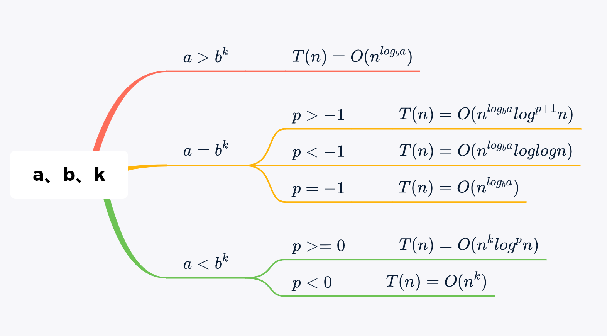
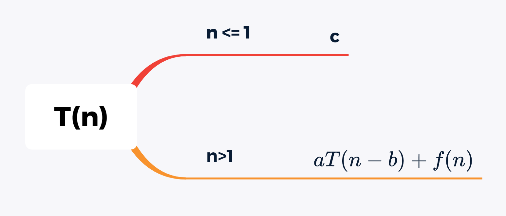
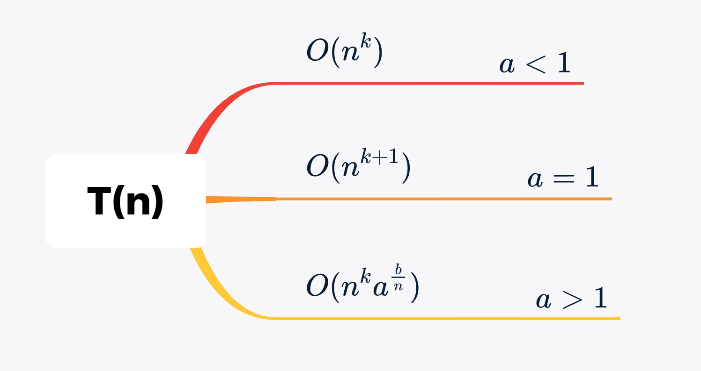

# 算法概论

## 算法的概念

### 什么是算法

算法的设计应满足以下几个目标：正确性、可使用性、可读性、健壮性、高效率与低存储量需求。

算法应具有以下5个重要特性：有限性、确定性、可行性、输入性、输出性。

### 算法和数据结构

算法和数据结构既有联系又有区别。

数据结构是算法设计的基础。算法的操作对象是数据结构，在设计算法时通常要构建适合这种算法的数据结构。数据结构的设计主要是选择数据结构的存储方式，例如确定求解问题中的数据采用数组存储还是采用链表存储等。算法设计就是在选定的存储结构上设计一个好的算法。

另外，数据结构关注的是数据的逻辑结构、存储结构以及基本操作，而算法更多的是关注如何在数据结构的基础上解决实际问题。算法是编程思想，数据结构则是这些思想的逻辑基础。

## 算法分析

通常有两种衡量算法效率的方法：事后统计法和事前分析估算法。前者存在这些缺点：一是必须执行程序，二是存在其他因素掩盖算法本质。所以我们一般采用事前分析估算法来分析算法效率。


### 数学基础

* **算术级数**

$$
\displaystyle \sum^{n}_{k=1}{k} = n (n+1)/2
$$

* **几何级数**

$$
\displaystyle \sum^{n}_{k=0}{x^k} = \frac{x^{n+1} - 1}{x-1}
$$

* **调和级数**

$$
\displaystyle \sum^{n}_{k = 1}{\frac 1 k} = logn
$$

* **其他级数**
$$
\displaystyle \sum^{n}_{i=1}{i^2} = n (n+1)(2n+1)/6
$$

$$
\displaystyle \sum^{n}_{k=1}{2^{k-1}} = 2^n -1
$$

$$
\displaystyle \sum^{n}_{k=1}{logk} = nlogn
$$


### 主要定理

#### 1、分治法主定理

所谓分治算法是把一个问题划分成多个子问题，每个子问题是原问题的一部分，然后执行一些额外的工作来计算最后的答案。

例如，归并排序算法计算两个子问题，每个子问题都是原问题规模的一半，然后利用`O(n)`时间的额外工作完成归并。时间公式为：
$$
T(n) = 2T(\frac{n}{2}) + O(n)
$$

下面的定理可以用来确定分治算法的运行时间。对于一个给定的程序（算法），首先尝试找到问题的递归关系。**如果问题的递归满足下面的公式，那么可以直接算出时间复杂度：**
$$
T(n) = aT(\frac{n}{b}) + O(n^klog^pn)
$$
其中：$a >= 1, b > 1, k >= 0 且 p 是实数$，则：




#### 2. 问题规模减小和递归求解主定理






## 实战演练

### 第一题

```cpp
void function(int n) {
    int i = 1, s = 1;
    // s每次增减i
    while(s <= n) {
        i++;
        s += i;
        printf("*");
    }
}
```

如果k是函数迭代的总次数，那么当循环终止时应该满足的条件是：
$$
1 + 2 +...+k = \frac{k(k+1)} {2} > n \quad => \ k = O(\sqrt n)
$$


### 第二题

```cpp
void function(int n) {
    int count = 0;
    // 外层循环执行 n / 2 次
    for(int i = n / 2; i <= n; i++) {
        // 中间循环执行 n / 2 次
        for(int j = 1; j + n / 2 <= n; j++) {
            // 内层循环执行logn次
            for(int k = 1; k <= n; k *= 2) {
                count++;
            }
        }
    }
}
```

**时间复杂度：$O(n^2logn)$**


### 第二题

```cpp
void function(int n) {
   	// 常数时间
    if(n == 1) return;
    // 外层函数执行n次
    for(int i = 0; i < n; i++) {
        // 由于break语句，内层循环只执行了一次
        for(int j = 0; j < n; j++) {
            printf("*");
            break;
        }
    }
}
```

**时间复杂度：$O(n)$** 


### 第三题

```cpp
void function(int n) {
    // 外层循环执行n次
    for(int i = 1; i <= n; i++) {
        // 里层循环执行 n / i 次， j每次增加i
        for(int j = 1; j <= n; j += i) {
            printf("*");
        }
    }
}
```

对于每一个`i`，内层循环执行`n / i `次。运行时间是：
$$
n \times (\sum^{n}_{i = 1}{n / i}) = O(nlogn)
$$

### 第四题

```cpp
void function(int n) {
    // 常数时间
    if( n == 1) return;
    // 外层循环执行n次
    for(int i = 0; i < n; i++) {
        // 内层循环执行n次
        for(int j = 0; j < n; j++) {
            // 常数时间
            printf("*");
        }
    }
    function(n - 3);
}
```

显然代码的递归表达式为$T(n) = T(n-3) + c \cdot n^2$，其中常数 $c > 0 $。输出语句执行$n^2$次，递归调用自身输入规模是$n-3$。

根据问题规模减小和递归求解主定理，求得$T(n) = O(n^3)$


### 第五题

```cpp
void function(int n) {
    int k = 1;
    while(k < n) {
        k *= 3;
    }
}
```

循环终止条件是$3^i \geq n$，$i >= log_3n$ 所以时间复杂度为$O(logn)$


### 第六题

确定如下递归关系的渐进时间复杂度
$$
T(n)\begin{cases}
1 & n = 1 \\
T(n-1) + n(n-1) & n \geq 2
\end{cases}
$$

此问题可以用分治法主定理公式求解，下面给出迭代分析的过程：
$$
T(n) = T(n-2) + (n-1)(n-2) + n(n-1)\\
...\\

T(n) = T(1) + \sum_{i=1}^{n}i(i-1) \\
T(n) = T(1) + \sum_{i=1}^{n} i^2 - \sum_{i=1}^{n} i \\
T(n) = 1 + \frac {n(n+1)(2n+1)} {6} - \frac {n(n+1)} {2} \\
T(n) = O(n^3) \\
$$

### 第七题

```cpp
void function(int n) {
    // 外层循环执行n次
    for(int i = 0; i < n; i++) {
        // 里层循环执行 n / i 次， j每次增加i
        for(int j = 0; j < n; j += i) {
            printf("*");
        }
    }
}
```

对于每一个i，内层循环执行n / i 次。运行时间是：
$$
n \times (\sum_{i=1}^{n} n / i) = O(nlogn)
$$


### 第八题

```cpp
void function(int n) {
    // 常数时间
    if(n <= 1) return;
    // 执行三次值为n-1的递归调用
    for(int i = 0; i < 3; i++) {
        function(n-1)
    }
}
```

只考虑三次递归调用。这意味着时间复杂度为：


$$
T(n)= \begin{cases}
c & n \leq 1 \\
c + 3T(n-1) & n \gt 1
\end{cases}
$$

利用问题规模减小和递归求解主定理，可得：
$$
T(n) = O(3^n)
$$


### 第九题

```cpp
void function(int n) {
    if(n <= 1) return;
    else {
        printf("*");
        // 递归调用，参数值为2
        function(n/2);
        // 递归调用，参数值为2
        function(n/2);
    }
}
```

函数递归公式为：
$$
T(n) = 2T(n/2) + 1
$$
根据主定理：
$$
T(n) = O(n)
$$


### 第十题

```cpp
void function(int n) {
    int i = 1;
    while(i < n) {
        int j = n;
        while(j > 0) {
            // logn次
            j = j / 2;
        }
        // logn次
        i = 2 * i;
    }
}
```

时间复杂度为$O(logn * logn) = O(log^2n)$


### 第十一题

```cpp
int i = 1, n;
while( i < = n) {
    j *= 2
}
```

对于任意$n \gt 0$，循环执行的比较次数为：$ceil(log_2n) + 1$


### 第十二题

```cpp
void function(int n) {
    // 执行n次
    for(int i = 0; i < n; i++) {
        // 执行n*n次
        for(int j = 0; j < i*i; j++) {
            if(j % i == 0) {
                // 执行j = n*n次
                for(int k = 0; k < j; k++) {
                    printf("*");
                }
            }
        }
    }
}
```

时间复杂度为：$O(n^5)$


### 第十三题

```cpp
int fact(int n) {
    if(n <= 1) return 1;
    return n * fact(n-1);
}

时间复杂度：$O(n)$
