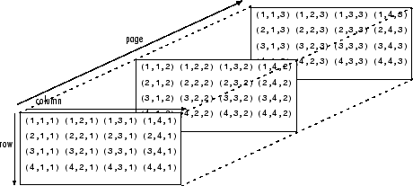

# MATLAB

## 背景知识

MATLAB语言为数学问题的计算机求解，特别是控制系统的仿真领域起到了巨大的推动作用。1978年美国New Mexico大学计算机科学系的主任**Cleve Moler教授**认为用当时最先进的**EISPACK和LINPACK**软件包求解线性代数问题过程过于繁琐，所以构思一个名为**MATLAB（Matrix Laboratory，矩阵实验室）**的交互式计算机语言。可以说，MATLAB语言是由计算机数学专家首创，但是由控制学界捧红的计算机语言，很大一部分都是面向自动控制和相关学科的。稍后出现的**Mathematica及Maple**等语言也应用广泛。

## 编程基础

### HelloWorld

```matlab
disp('Hello, World');
```

### 保留的常数

| 常数                | 含义                                                         |
| ------------------- | ------------------------------------------------------------ |
| `eps`               | epsilon，机器的浮点数运算误差限。PC上eps的默认值为 $2.2204 \times 10^{-16} $，若某个量的绝对值小于eps，可以认为为0。 |
| `i和j`              | 若常量未被改写，则他们表示纯虚数$\sqrt{-1}$ 。               |
| `Inf或inf`          | 无穷大量                                                     |
| `NaN`               | 不定式（not a number），通常0/0、inf/inf、0*inf可得出NaN。   |
| `pi`                | 圆周率                                                       |
| `true和false`       | 逻辑变量                                                     |
| `lasterr和lastwarn` | 存放最新一次的错误和警告信息                                 |

**MATLAB的语句之间可以有逗号或者分号分隔，也可以直接换行开始下一条语句。**若语句末尾没有分号，则会直接显示执行结果。否则结果不会显示出来，需要手动打印。

### 显示格式设置

MATLAB使用`format`命令来设置显示格式，常用命令有

```matlab
format short;		% 设置显示格式为短型，小数点后显示4位有效数字
format long;		% 设置显示格式为长型，小数点后显示15位有效数字
```

| 参数      | 含义           |
| --------- | -------------- |
| `short`   | 短型           |
| `long`    | 长型           |
| `compact` | 紧凑型         |
| `loose`   | 宽松型（默认） |
| `rat`     | 有理型         |

> **注意：format命令并不改变结果，他改变的只是显示形式。**


### 设置工作目录

MATLAB默认的工作目录是程序安装路径的bin文件夹，该路径是只读的。为了方便，我们最好重新设置个工作目录，我并没有这MATLAB中找到相关设置选项，但是我们可以采用一种巧妙的方法：

由于MATLAB启动时候，会自动执行工作目录下的一个名为`startup.m`文件，所以我们可以在bin目录创建一个`startup.m`文件，输入下面的代码：

```matlab
cd('F:\WorkSpace\MATLAB')		% 切换到新的工作目录
!code .		% 执行dos命令，用vscode打开此工作目录(我喜欢在vscode中编写代码)

% 下面还可输入更多的命令，如果你希望一些工作在启动的时候就自动完成
```

另一种方法是在桌面创建一个MATLAB快捷图标，**鼠标右键 => 属性 => 起始位置**。在起始位置中填入你的工作目录就行。缺点是不能执行其他命令，对你来说够用的话，可以尝试。

### 图形界面编辑

MATLAB的`openvar()`函数会打开一个数据编辑图形界面，允许用户可视化编辑变量，**传输的参数是变量名的字符串形式。**

```matlab
openvar('var');
```

### 冒号表达式

冒号表达式的格式为 `V = s1:s2:s3`，该函数生成一个行向量V。

* s1：向量起始值
* s2：步距
* s3：最大值，元素可以等于最大值，但不能超过最大值

**若省略s2，则默认步距值为1。**

```matlab
v1 = 0:0.2:pi;	%[0, 0.2, 0.4,..., 3]，因为下一个取值3.2大于pi，所以只能取到3
v2 = 0:-0.1:pi;	%[]	1x0的空矩阵
v3 = 0:pi;	% [0, 1, 2, 3]
v4 = 3:-1:0;	%[3, 2, 1, 0]

a = 13:13:1000		% 找到1000以内能被13整除的所有整数
```


### 等间距行向量生成

**线性等间距点的生成：** `v = linspace(n1, n2, N)`，起始值为n1，终止值为n2，向量点数为N（默认50）。这样的向量又称为线性等间距向量

**对数等间距点的生成：** `w = logspace(n1, n2, N)`，起始值为lgn1（以10为底），终止值为lgn2，向量点数为N


## 常用数据结构

### 数值型数据

MATLAB最基本的数据结构是**双精度复数矩阵**。矩阵的的内容由**方括号**括起来的的内容表示。在方括号中，分号或者回车表示矩阵的换行，逗号或者空格用来分割同一行元素。MATLAB创建变量不需要提前声明。

```matlab
%创建一个3x3的矩阵，此处为了演示，故意逗号和空格混用，建议保持风格一致
a = [1 2 3; 4, 5, 6; 7, 8 9];

% 可以动态调整矩阵的维数，下面将a增加一行和一列
a = [a; [1, 2, 3], [1;2;3;4]]
```

MATLAB环境中定义了两个记号：`i和j`，效果相同，可以用来直接输入复数矩阵。需要注意，不建议单独使用`i或者j`，建议使用`1i或者sqrt(-1)`具体参考下面例子最后一个元素。

```matlab
% 此处为了演示，i和j混用，建议风格统一。单独出现i，前面要加系数1，或者使用sqrt(-1)
b = [1+9i, 2+8i; 3+7j, sqrt(-1); 5+5i, 1i]
```


### 符号型数据

MATLAB定义了符号型（symbolic）变量，用于区别常规的数值型变量，可以用于公式推导和数学问题的解析解法。

> 为什么需要符号性数据？举个简单例子，如果采用双精度存储`a = 1/3`，但是我们都知道`1/3`转换成`0.333333...`无论多少位，后面的3肯定会被截断，就产生了误差。但是符号性数据`sym(1/3)`始终是`1/3`，全称参与运算，所以不会产生误差

进行解析运算前，需要首先将采用的变量声明为符号变量，这需要`syms`命令实现。

```matlab
syms 变量名列表 变量集合
```

变量名列表：需要声明的变量列表，可以同时声明多个变量，中间只能以空格分隔，不能用逗号或其他符号。

| 常见变量集合 | 含义   |
| ------------ | ------ |
| `positive`   | 正数   |
| `integer`    | 整数   |
| `real`       | 实数   |
| `rational`   | 有理数 |

| 常见函数       | 含义                                                         |
| -------------- | ------------------------------------------------------------ |
| assumptions(x) | 返回符号变量x的类型                                          |
| x = symvar(f)  | 从符号表达式f中提取符号变量列表，赋值给x                     |
| vpa(a, n)      | 精度算法函数，将表达式或矩阵a，以有效数字n显示出来。n可以省略，默认32位十进制位数 |
| assume()       | 设置符号变量的属性                                           |
| assumeAlso()   | 进一步设置符号变量属性                                       |
| sym(a)         | 将a转换成符号变量                                            |

```matlab
syms x y real;		% 声明x，y为实数

assume(x >= -1);	% 设置符号变量属性
assumeAlso(x < 5);

assumptions(x);		% 读出符号变量的类型

vpa(pi, 105);		% 显示π的前105位
vpa(pi);			% 显示π的前32位

a = 123
a = sym(a);			% 将a转换成符号型变量
```


#### 任意符号型矩阵的生成

```matlab
B = sym('b%d%d', [3, 3]);		% 生成以b开头的，3x3矩阵
%{
[b11, b12, b13]
[b21, b22, b23]
[b31, b32, b33]
%}
```

#### 符号型函数

由`syms`声明，先声明自变量为符号变量，再声明函数F(x)和G(x, y, z, u)

```matlab
syms x y z u F(x) G(x, y, z, u)
```


### 整型与逻辑变量

MATLAB提供了一系列的整型和无符号整型的数据类型：`int8(), int16(), int32()`、`uint8(), uint16(), uint32()`等。

MATLAB还提供了逻辑性数据结构，只能取0和1

```matlab
a = uint8(123);		% 设置a为无符号8位整型
b = logical(1);		% 设置b为逻辑1
```


### 数据结构类型识别

| 数据结构类型    | 含义                             |
| --------------- | -------------------------------- |
| double          | 双精度                           |
| single          | 单精度                           |
| int*            | 整型，星号代表位数，如16位       |
| uint*           | 无符号整型，星号代表位数，如16位 |
| char            | 字符型、字符串                   |
| logical         | 逻辑型                           |
| struct          | 结构体                           |
| cell            | 单元数组（元胞数组）             |
| function_handle | 函数句柄                         |

```matlab
key = class(a);		% 将a的数据结构类型赋值给key
key = isa(a, 'double');		% 判断a是否为double
```


### 矩阵维数识别

```matlab
len = length(A);	% 矩阵A行数和列数最大值
lenRow = size(A, 1);	% 矩阵行数
lenCol = size(A, 2);	% 矩阵列数
```

MATLAB提供了`reshape()`函数来重新调整矩阵维数，其方法是，将A矩阵先按列展开生成列向量，将其截为长度为n的列向量，总共可以截m段。这样就可以将这些列向量依次排列，重新构造出矩阵B。MATLAB会自动判断用户输入的行列数乘积个数是否与原来一致。

```matlab
B = reshape(a, n, m);
% 或者
B = reshape(a, [n, m])
```


### 字符串数据结构

与C语言等程序设计不同的是，MATLAB字符串使用的是单引号，而且无论是字符还是字符串，数据类型名都是`char`。

```matlab
strA = 'Hello, World!';		% 声明一个字符串变量
strB = 'QIUYEYIJIAN';

strC = [strA, strB, strA];	% 三个字符串串联，相当于字符串拼接
strD = str2mat(strA, strB, strA);	% 将字符串处理成数组，一行存放一个字符串
strD = strvcat(strA, strB, strA);	% 和str2mat效果相同

strE = strD(1, :);			% 提取第一行字符串

strF = 'QIU''YEYIJIAN';		% 字符串内出现单引号，用两个单引号表示
```

#### 字符串的处理方法

| 方法                              | 含义                                                         | 其他           |
| --------------------------------- | ------------------------------------------------------------ | -------------- |
| `k = strcmp(str1, str2);`         | str1, str2为两个被比较的字符串。完全相同k = 1，否则为k = 0   | 字符串比较     |
| `k = findstr(str1, str2);`        | 返回较短的字符串在另一个字符串出现的下标位置，如果不存在则返回空矩阵。 | 字符串查找     |
| `str = strrep(str1, str2, str3);` | 使用str3替换掉str1中内容为str2的子字符串，结果赋值给str      | 字符串替换     |
| `k = length(str)`                 | 获取字符串长度                                               | 获取字符串长度 |

```matlab
strA = 'Hello, World';
strB = strrep(strA, 'World', 'Boy');	% 将strA中 World 替换成 Boy

strA = deblank(strA);		% 删除strA末尾空格
strA = strA(strA~=' ');		% 删除全部空格

v = double(strA);			% 将各个字符转换成ASCII码
s1 = char(v);				% 转换成原来的字符串

str = num2str(v, n);		% v是行向量，n指定有效数字位数，不写默认小数点后四位有效数字

% 以特定格式生成字符串，类似C语言，%d整数，%f浮点数，%s字符串
str = sprintf('圆的周长：%f, 圆的面积：%f', 2*pi*5, pi*5*5);
```


#### 字符串命令执行

MATLAB提供了可以执行字符串命令的函数`eval()`。实际编程中有时可以将命令生成字符串str的形式，然后调用`eval(str)`函数执行字符串。

```matlab
eval('!echo Hello, world!');	% 执行Dos命令，打印Hello，world!
```


### 多维数组

MATLAB是一种通用的程序设计语言，所以除了用于计算的数值型、符号型、字符串数据结构外，还支持其他数据结构，如结构体、多维数组、单元数组、表格型、类与对象等数据结构。

#### 概念与用途

三维数组是一般矩阵的直接扩展，可以这样理解，三维数组可以直接用于彩色数字图像的描述，在控制系统的分析中也可以直接用于多变量系统的频域响应表示。在实际编程中还可以使用更高维度的数组。

每个元素由两个下标（即行索引和列索引）来定义。多维数组是二维矩阵的扩展，并使用额外的下标进行索引。例如，三维数组使用三个下标。前两个维度就像一个矩阵，而第三个维度表示元素的页数或张数。



在图像处理与计算机视觉领域，可以将图像用矩阵表示，矩阵每个元素表示图像像素的灰度值。如果仿照上图的方式，用摞起来的三个矩阵分别表示图像的红、绿、蓝像素分量，则这样摞起来的三个矩阵就构成了三维数组，可以用来表示彩色图像。


#### 创建多维数组

```matlab
% 首先创建一个二维矩阵，然后进行扩展
A = [1 2 3; 4 5 6; 7 8 9];
% 语法 A(:,:,2) 在第一个和第二个维度中使用冒号，以在其中包含赋值表达式右侧的所有行和所有列
% 意思是第一和第二维度保持不变，在原来的基础上增加一页，参考上面的图
A(:,:,2) = [10 11 12; 13 14 15; 16 17 18];

% 在A的第三维度再增加一页，第一个参数指示要沿哪一个维度进行串联，三维数组则是3
B = cat(3,A,[3 2 1; 0 9 8; 5 3 7]);

% 将三维数组A的第5页全部赋值1，中间如果有没有定义的页数，则自动增加该页，并赋值0
A(:, :, 5) = 1;
```


#### 访问多维数组

```matlab
% 访问第三页，第一行，第二列的元素
elA = A(1, 2, 3);
% 只访问每一页，每一行的第1列和第3列元素
elB = A(:, [1 3], :);
% 使用冒号运算符创建索引向量，访问每一页，每一列的第1-3行数据
elC = A(1:3, :, :);

```


### 元胞数组

单元数组是矩阵的直接扩展，其存储格式类似于普通矩阵，而矩阵的每个元素不是数值，可以认为能存储任意类型的信息，这样每个元素称为“元胞”（cell）

元胞数组是包含称为元胞的索引数据容器的数据类型。**每个元胞可以包含任意类型的数据**。元胞数组通常包含文本块、来自电子表格或文本文件的文本和数字的组合，或者不同大小的数值数组。

引用元胞数组的元素有两种方法。将索引括在圆括号 () 中以引用元胞集，例如，用于定义一个数组子集。将索引括在花括号 {} 中以引用各个元胞中的文本、数字或其他数据。


#### 创建元胞数组

```matlab
% 使用花括号创建空的元胞数组
C = {};

% 使用cell创建空的元胞数组
emptyCell = cell(3, 4, 2);	% 3行2列，一共2页
```


#### 访问元胞数组

引用元胞数组的元素有两种方法。

- 将索引括在圆括号 () 中以引用**元胞集**，可以理解多个元胞组成的集合。例如，用于定义一个数组子集。
- 将索引括在花括号 {} 中以引用各个元胞中的文本、数字或其他**数据**。可以理解为具体的某一个元胞。

```matlab
% 创建一个由文本和数值数据组成的 2×3 元胞数组
C = {'one', 'two', 'three'; 1, 2, 3}
```

**圆括号中的元胞数组索引引用元胞集。**

```matlab
% 要创建一个属于 C 的子集的 2×2 元胞数组，请使用圆括号
c1 = C(1:2, 1:2);

% 将 C 的第一行中的元胞替换为大小相等 (1×3) 的元胞数组。
C(1,1:3) = {'first','second','third'}

% 如果数组中的元胞包含数值数据，可以使用 cell2mat 函数将这些元胞转换为数值数组
numericVector = cell2mat(C(2,1:3))
```

**通过使用花括号进行索引来访问元胞的内容，即元胞中的数字、文本或其他数据。**

```matlab
% 要访问 C 的最后一个元胞的内容
last = C{2,3}

% 使用花括号进行索引来替换元胞的内容。
C{2,3} = 300
```

您可以使用花括号进行索引来访问多个元胞的内容。MATLAB® 会以*逗号分隔的列表*形式返回这些元胞的内容。因为每个元胞可以包含不同类型的数据，所以无法将此列表分配给单个变量。但是，您可以将此列表分配给与元胞数量相同的变量。**MATLAB® 将按列顺序赋给变量。**

将 `C` 的四个元胞的内容赋给四个变量。

```matlab
% r1c1 = 'first' r2c1 = 1 r1c2 = 'second' r2c2 = 2
[r1c1, r2c1, r1c2, r2c2] = C{1:2,1:2}
```

如果每个元胞都包含相同类型的数据，则可以通过将数组串联运算符 `[]` 应用于逗号分隔的列表来创建单个变量。

将第二行的内容串联到数值数组中。

```matlab
nums = [C{2,:}]
```


### 表格数据

table 是一种适用于以下数据的数据类型：即以列的形式存储在文本文件或电子表格中的列向数据或者表格数据。表由若干行向变量和若干列向变量组成。**表格中的每个变量可以具有不同的数据类型和大小，但有一个限制条件是每个变量的行数必须相同。**

#### 创建并查看表

首先构造一些数据，方便接下来制作表格

```matlab
% 将patient.mat文件导入工作区变量中，此文件是MATLAB内置的，用于演示的数据文件
load patients;
whos	% 查看一下变量信息
% Tb = readtable('patients.dat');	% 读取表格的另一种方法
```

创建一个表并使用 `Gender`、`Smoker`、`Height` 和 `Weight` 工作区变量填充它。注意，因为这几个变量的行数是一样的，所以可以创建成功。

```matlab
% 通过table创建表格，传变量的名称作为字段名，变量值作为该字段下对应的值
Tb = table(Gender, Smoker, Height, Weight);
% 获取前五行，所有列
TbNew = Tb(1:5, :)

% 查看表格的汇总信息，包括查看每个变量的数据类型、说明、单位和其他描述性统计量
summary(Tb)

% 查看表格信息, 返回行数和列数
size(Tb)
```

插入一个新字段`ID`

```matlab
% randi([imin imax],m,n)	生成处于最大和最小之间的m x n的数组, 可以取到最大和最小
% 最小值可以不写，默认从1开始
Tb.ID = randi(1e4, 100, 1)
```


#### 按行和变量名称访问数据

```matlab
% 添加行名称RowNames, 注意，size()计算的时候，并不会将此字段计算在内
Tb.Properties.RowNames = LastName;
size(Tb)

% 使用行名称，索引特定的行；比如选择名为Smith和Johnson的所有数据
TbNew = Tb({'Smith', 'Johnson'}, :)

% 选取名为Johnson的身高和体重
TbNew = Tb('Johnson', {'Height', 'weight'})

% 选取某一字段所有值; 比如身高
Tb.Height
% 或者下面所示
Tb(:, 'Height')
```


#### 计算结果并将其添加为表变量

根据现有表变量中的数据计算体质指数 (BMI)，并将其添加为新变量。绘制 BMI 与患者状态为烟民或非烟民的关系图。向表中添加血压读数，并绘制血压与 BMI 的关系图。

```matlab
T.BMI = (T.Weight*0.453592)./(T.Height*0.0254).^2;
```

你可以给相关字段值添加一些描述信息

```matlab
% 查看都有哪些属性
Tb.Properties
% 给BMI字段添加变量单位的信息
Tb.Properties.VariableUnits{'BMI'} = 'kg/m^2';
% 给BMI添加描述信息
Tb.Properties.VariableDescriptions{'BMI'} = 'Body Mass Index';

% 获取相关信息
Tb.Properties.VariableUnits('BMI')
```


创建一个直方图以探索这组患者的吸烟与体质指数之间是否存在关系。您可以使用 Smoker 表变量中的逻辑值来索引 BMI，这是因为每行都包含同一患者的 BMI 和 Smoker 值。

```matlab
% 选择不吸烟者
tf = (Tb.Smoker == false);
h1 = histogram(Tb.BMI(tf),'BinMethod','integers');
hold on
% 选择吸烟者
tf = (Tb.Smoker == true);
h2 = histogram(Tb.BMI(tf),'BinMethod','integers');

xlabel('BMI (kg/m^2)');
ylabel('Number of Patients');
legend('Nonsmokers','Smokers');
title('BMI Distributions for Smokers and Nonsmokers');
hold off
```


从工作区变量 Systolic 和 Diastolic 中添加患者的血压读数。每一行都包含同一患者的 Systolic、Diastolic 和 BMI 值。

```matlab
Tb.Systolic = Systolic;
Tb.Diastolic = Diastolic;
```

创建一个直方图来显示 `Diastolic` 和 `BMI` 的较高值之间是否存在关系。

```matlab
tf = (Tb.BMI <= 25);
h1 = histogram(Tb.Diastolic(tf),'BinMethod','integers');
hold on
tf = (Tb.BMI > 25);
h2 = histogram(Tb.Diastolic(tf),'BinMethod','integers');
xlabel('Diastolic Reading (mm Hg)');
ylabel('Number of Patients');
legend('BMI <= 25','BMI > 25');
title('Diastolic Readings for Low and High BMI');
hold off
```


#### 对表变量和输出行进行重新排序

```matlab
% 按行名称对表进行排序，以使患者按字母顺序列出。
Tb = sortrows(Tb, 'RowNames');

% 创建一个 BloodPressure 变量，将血压读数保存在一个 100×2 的表变量中
Tb.BloodPressure = [Tb.Systolic Tb.Diastolic];

% 从表中删除 Systolic 和 Diastolic
T.Systolic = [];
T.Diastolic = [];
T(1:5,:)

% 要将 ID 作为第一列，请按位置重新排列表变量, 假设ID在第6列
Tb = Tb(:, [6 1:5 7])
```


#### 将表写入文件

```matlab
writetable(Tb,'test.txt');
```


### 结构体

结构体数组是使用名为字段的数据容器将相关数据组合在一起的数据类型。每个字段都可以包含任意类型的数据。

结构体可以包含下级信息，称为域（field）或成员变量（membership variable）。使用 structName.fieldName 格式的圆点表示法来访问结构体中的数据。

#### 创建结构体和结构体数组

```matlab
% 创建单个结构体stu
stu.name = 'Qiuyeyijian';
stu.age = 18;
stu.score = 100;

% 创建结构体数组patient
patient(1).name = 'John';
patient(1).billing = 127.00;
patient(1).test = [79 75 73; 180 178 177.5; 220 210 205];

patient(2).name = 'Ann Lane';
patient(2).billing = 28.50;
patient(2).test = [68, 70, 68; 118, 118, 119; 172, 170, 169];
patient
```


数组中的每条患者记录都是 struct 类的结构体。由结构体构成的数组通常称为结构体数组。与其他 MATLAB 数组类似，结构体数组可以具有任意维度。

结构体数组具有下列属性：

- **数组中的所有结构体都具有相同数目的字段。**

- **所有结构体都具有相同的字段名称。**

- **不同结构体中的同名字段可包含不同类型或大小的数据。**

```matlab
% 获取结构体数组中的数据，画一个条形图
bar(patient(1).test)
title(['Test Results for', patient(1).name])
```


#### 访问结构体中数据

```matlab
% 为了演示方便，直接导入MATLAB已有的数据文件
s = load('flujet.mat');

% 获取某个字段的所有值，画一幅图像
image(s.X)
colormap(s.map)

% 获取部分值
centerLeft = s.X(150:250, 1:50);
image(centerLeft);
```


#### 访问嵌套结构体中的数据

所谓嵌套结构体，就是结构体中的某些成员变量仍然是结构体。

```matlab
structName(index).nestedStructName(index).fieldName(indices)
```


## 流程控制结构

### 循环结构

表达式1的值为循环变量的初值，表达式2的值为步长，表达式3的值为循环变量的终值。**步长为1时，表达式2可以省略。**

```matlab
for index = values
   statements
end
```

values为一个向量，循环变量index每次从values依次提取一个值，执行一次循环体中的内容，直到执行完values中所有变量。

while语句执行过程：若条件成立，则执行循环体语句，执行后在判断条件是否成立。如果成立，则继续执行循环体语句，如果不成立则跳出循环。

```matlab
while (条件)
	循环体语句
end
```

MATLAB循环结构中，依然可以使用`break`、`continue`、`return`，作用和C语言相同


### 条件转移结构

```matlab
if 条件
	语句组1
elseif 条件
	语句组2
else
	语句组3
end
```

```matlab
switch 表达式
	case 表达式1
		语句组1
	case 表达式2
		语句组2
    case 表达式3
		语句组3
	otherwise
		语句组n
end
```


### 试探结构

MATLAB也提供了try...catch结构，可以用来调试错误。

```matlab
% 一段代码告诉你该怎么用
try
    a = notaFunction(5,6);
catch ME
    switch ME.identifier
        case 'MATLAB:UndefinedFunction'
            warning('Function is undefined.  Assigning a value of NaN.');
            a = NaN;
        case 'MATLAB:scriptNotAFunction'
            warning(['Attempting to execute script as function. '...
                'Running script and assigning output a value of 0.']);
            notaFunction;
            a = 0;
        otherwise
            rethrow(ME)
    end
end
```


## 编程

MATLAB的m文件分为两种：一种是脚本文件，另一种是函数文件。

脚本文件：不接收输入参数，也不返回参数，类似于DOS下的批处理文件。

脚本文件运行过程中所产生的变量保存在MATLAB的工作区间中，脚本文件也可以访问MATLAB当前工作区间的变量，其他脚本文件和函数可以共享这些变量。因此、脚本文件常用于主程序设计。

函数文件：可以接收输入参数，也可以有返回值。**文件的名称必须和函数名一致。**函数文件中的变量除了特殊声明外，均为局部变量，单独存放在函数工作区内，文件执行完毕后立即释放，不会和MATLAB的工作区间产生冲突。工作区间只会存储输入和输出参数。

### 函数

创建函数，包括匿名函数、局部函数和嵌套函数。函数包含序列命令，可以接受输入并返回输出。**命名函数必须在程序文件中定义**，而不能在命令行中定义。要定义函数，请使用以下语法：

```matlab
% 其中 y1,...,yN 是输出，x1,...,xM 是输入，myfun 是函数名称
function [y1,...,yN] = myfun(x1,...,xM)
```

> 包含命令和函数定义的脚本文件中。函数必须位于该文件的末尾。脚本文件不能与文件中的函数具有相同的名称。
>

函数结构中一般都应有变量检测部分。如果输入或返回变量格式不正确，则应给出相应提示。只要进入函数，MATLAB会自动生成两个变量：`nargin`和`nargout`。分别表示输入和返回变量的实际个数，可以用于变量检测。

```matlab
function c = addme(a,b)
% ADDME  将两个数相加		% H1行
%   C = addme(a) return a + a
%
%   C = addme(a,b) return a + b
%
%   See also SUM, PLUS.

% 以下是函数主体，上面注释是H1行和帮助文本
switch nargin
    case 2
        c = a + b;
    case 1
        c = a + a;
    otherwise
        c = 0;
end
```

一个典型的MATLAB函数，应该包括：函数定义行、H1行、帮助文档、函数主体以及注释。

* 函数定义行：就是声明函数的语句，以`function`开头.
* H1行：是函数帮助文本的第一行，以%开头，用来概括说明该函数的功能。在MATLAB中用命令lookfor查找某个函数时，查找到的就是函数H1行及其相关信息。
* 函数帮助文本：在H1行之后，函数体之前的说明文本就是函数帮助文本。
* 函数主体以及注释：实现函数功能，并在关键代码给出注释说明

用户在输入`help addme`时，就会显示H1行和帮助文本。


#### 递归调用

``` matlab
function k = myFactorial(n)
    % myFactorial 计算n的阶乘

    % 输入参数个数检测
    if nargin ~= 1
        error('Error: Only one input variable accepted!');
    end

    % 判断n是否为非负整数
    if abs(n - floor(n)) > eps || n < 0
        error('n should be a non-negative integer');
    end

    % 如果n > 1就递归调用
    if n > 1
        k = n * myFactorial(n - 1);
    elseif any([0, 1] == n)
        k = 1;
    end

end
```

```matlab
function a = myFibo(n)
    % myFibo 递归计算斐波那契数列
    if n == 1 || n == 2
        a = 1;
    else
        a = myFibo(n - 1) + myFibo(n - 2);
    end
end

```

可以使用`tic`和`toc`来计算程序运行时间，例如在命令窗口调用函数

```matlab
tic, myFibo(40), toc
```


#### 可变输入输出个数

根据MATLAB自身的传递机制，会将输入变元以元胞数组的形式传递给一个名为`varargin`的变量，且变量的个数可以由`nargin`命令直接提取。类似地，输出变元由元胞数组型变量`varargout`返回。

```matlab
function a = addN(varargin)
    % 将输入的n个参数进行累加
    a = 0;
    for i = 1:nargin
        a = a + varargin{i};
    end
end
```

输入变元的容错处理

```matlab
检查输入变元或者输出变元的个数是否在指定的范围内
msg = nargchk(m, M, 'nargin')
msg = nargchk(m, M, 'nargout')
```


#### 匿名函数与inline函数

匿名函数无需编写对应的m文件，相当于动态定义函数。匿名函数只能返回一个变元，而且函数内部只能有一个表达式。

```matlab
f = @(变元列表) 函数表达式
% 例如 f = @(x, y)sin(x, y)
```

此外匿名函数还允许直接使用MATLAB工作空间的变量。例如，若在MATLAB工作区间内已经定义了a、b，则匿名函数可以这样定义

```matlab
f = @(x, y)a*x + b*y;
```

注意，a，b的值发生变化，需要再次运行该函数，f的值才能随之改变。

inline函数由于其历史局限性，可以被匿名函数完全取代。这里不再介绍。


#### 子函数

可以这样理解，一个m文件有且只能有一个函数与文件名重名，我们暂且称之为主调函数。如果主调函数太过复杂，我们可以拆分为几个子函数，写在它的后面。这几个子函数只能被这个主调函数调用。

#### 私有函数和重载函数

存放在名为`private`文件夹下的函数称为私有函数，只能被与`private` 文件夹在同一级的其他函数调用。

存放在以`@`开头的文件夹下的函数称为重载函数。


## 参考

1. 薛定宇：MATLAB程序设计—卷1
2. MATLAB官方文档
3. 张德丰：MATLAB R2017a