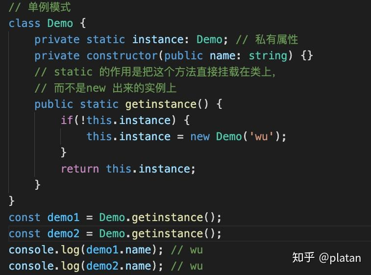

# Typescript

1、什么是单例模式

单例模式是为了保证一个特定类只有一个实例，当第二次使用同一个类 new 实例的时候，应该得到的是与第一次 new 的实例完全相同的对象。

2、TypeScript 单例模式的实现

- 定义一个单例模式的类
- 设置 constructor 为 private，即保护类外部不能直接 new 一个实例
- 定义一个 static 的方法，static 的作用是把这个方法直接挂载在类上，可以直接通过Demo.getinstance()来调用，而无需 new 一个实例对象
- 接着定义一个私有的static属性instance
- 在 getinstance()中，如果this.instance 为 undefined，就 new 一个实例，否则直接返回，这就保证了这个Demo类只有一个实例
- 即为单例模式

