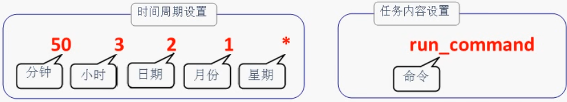

# 计划任务

计划任务分为一次性计划任务与长期性计划任务。

计划任务中的命令中使用 echo，cat 等输出命令的结果不会在终端显示，若有需要可以将结果存储到文件中。

### 一次行计划任务 at

顾名思义，一次性计划任务只执行一次，一般用于临时的工作需求。可以用 at 命令实现这种功能，只需要写成“at 时间”的形式就行。如果想要查看已设置好但还未执行的一次性计划任务，可以使用 at -l 命令；要想将其删除，可以使用“atrm 任务序号”。

表 4-6 at 命令的参数及其作用

| 参数 | 作用                   |
| ---- | ---------------------- |
| -f   | 指定包含命令的任务文件 |
| -q   | 指定新任务名称         |
| -l   | 显示待执行任务列表     |
| -d   | 删除指定待执行任务     |
| -m   | 任务执行后给用户发邮件 |

```bash
[root@QIUYEYIJIAN ~]# at 23:20
warning: commands will be executed using /bin/sh
at> systemctl restart httpd
at>	# 此处请同时按下<Ctrl>+<d>键来结束编写计划任务
job 8 at Sat Feb 26 23:20:00 2022
[root@QIUYEYIJIAN ~]#
```

```bash
echo "systemctl restart httpd" | at 23:30		# 使用管道符更简洁
```

用户设置好计划任务后开始倒计时执行

```bash
at now+2 MINUTE			# 两分钟后执行
```

### 长期性计划任务 crondtab

创建、编辑计划任务的命令为 crontab -e，查看当前计划任务的命令为 crontab -l，删除某条计划任务的命令为 crontab -r。另外，如果您是以管理员的身份登录的系统，还可以在 crontab 命令中加上-u 参数来编辑他人的计划任务。

| 参数 | 作用         |
| ---- | ------------ |
| -e   | 编辑计划任务 |
| -u   | 指定用户名称 |
| -l   | 列出任务列表 |
| -r   | 删除计划任务 |

**“分、时、日、月、星期、 (命)令”**这是使用 crond 服务设置任务的参数格式。需要注意的是，如果有些字段没有被设置，则需要使用星号（**\***）占位

| 字段 | 说明                                             |
| ---- | ------------------------------------------------ |
| 分钟 | 取值为 0 ～ 59 的整数                            |
| 小时 | 取值为 0 ～ 23 的任意整数                        |
| 日期 | 取值为 1 ～ 31 的任意整数                        |
| 月份 | 取值为 1 ～ 12 的任意整数                        |
| 星期 | 取值为 0 ～ 7 的任意整数，其中 0 与 7 均为星期日 |
| 命令 | 要执行的命令或程序脚本                           |

> - **\*** 取值范围内的所有数字
> - **/** 每过多少个数字
> - **-** 从 X 到 Z
> - **，**散列数字

```bash
crontab -e		# 编辑计划任务
```

```bash
# 每小时的第20分钟将date结果存储到1.txt中
20 * * * * /usr/bin/date >> 1.txt

# 每周1,3,5的13:20 将date结果存储到1.txt中
20 13 * * 1,3,5 /usr/bin/date >> 1.txt

# 每周1到周5的13:20 将date结果存储到1.txt中
20 13 * * 1-5 /usr/bin/date >> 1.txt

# 每1分钟 将date结果存储到1.txt中
*/1 * * * * /usr/bin/date >> result.txt
```

> 如果在 crond 服务中需要同时包含多条计划任务的命令语句，应每行仅写一条。
>
> **在 crond 服务的计划任务参数中，所有命令一定要用绝对路径的方式来写**
>
> 在 crond 服务的配置参数中，一般会像 Shell 脚本那样以#号开头写上注释信息，这样在日后回顾这段命令代码时可以快速了解其功能、需求以及编写人员等重要信息。
>
> **计划任务中的“分”字段必须有数值，绝对不能为空或是\*号，而“日”和“星期”字段不能同时使用，否则就会发生冲突。**