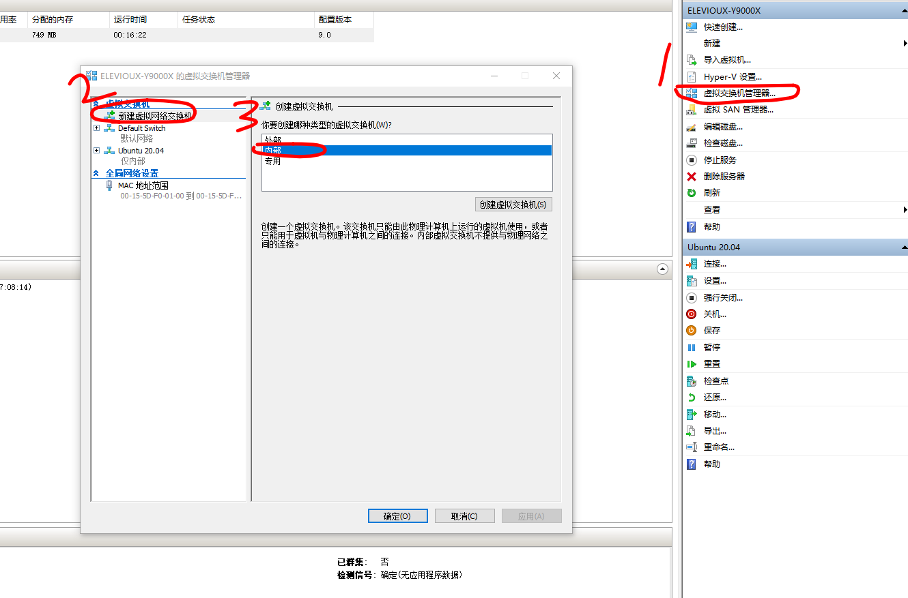
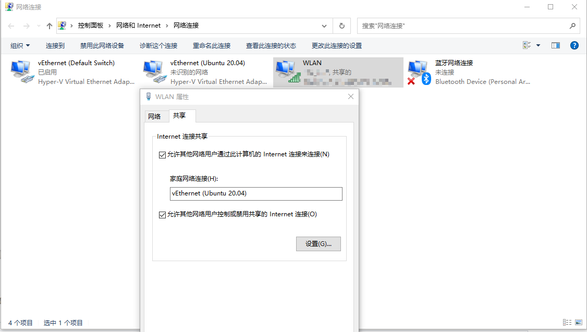
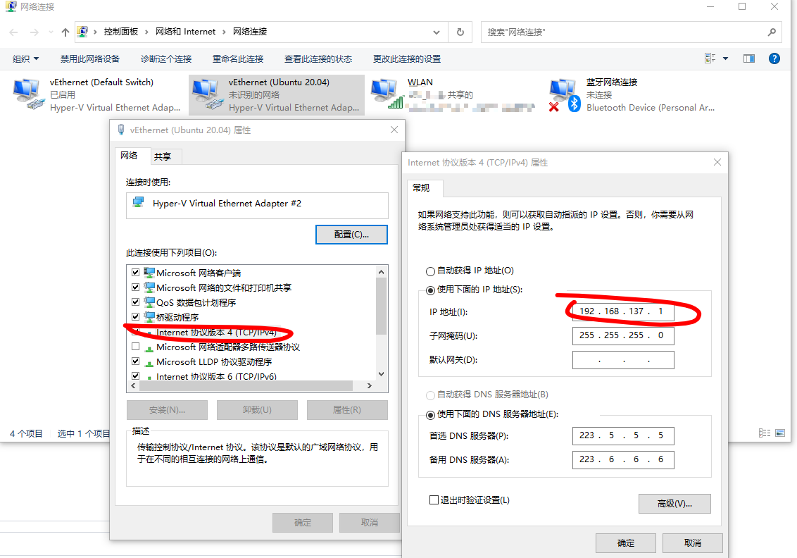

## Hyper V 下 Ubuntu Server 20.04 虚拟机固定IP

[Hyper V 下 Ubuntu Server 20.04 虚拟机固定IP – GWLin的博客](https://blog.gwlin.com/posts/6260)

今天重启机器后发现Ubuntu虚拟机的IP变了，这样会给平时工作带来额外不便。在网上看了一些文章，这里总结一下，帮助有需要的人。

1、在HyperV里添加一个虚拟网卡，像这样，注意选择内部类型：



2、设置网络共享。在网络适配器管理里，找到你的物理主机的上网网卡，右键打开属性，共享网络给刚刚新建的虚拟网卡。像这样：



注意弹窗提示的IP，它是网关IP，我的是192.168.137.1 ,这个后面配置会用到。虚拟网卡变成了这样：



3、进入虚拟机（hyperv面板里连接进入）。打开文件/etc/netplan/00-installer-config.yaml（注意先备份一下），编辑如下

```
network:
    ethernets:
        eth0:
            dhcp4: no
            dhcp6: no
            addresses: [192.168.137.128/24]
            gateway4: 192.168.137.1
            nameservers:
                    addresses: [223.5.5.5]

    version: 2
```

192.168.137.128可以自己设定，192.168.137.1是刚刚提示的网关，223.5.5.5是阿里的dns，可以自己换。

4、生效

```
sudo netplan apply
```

